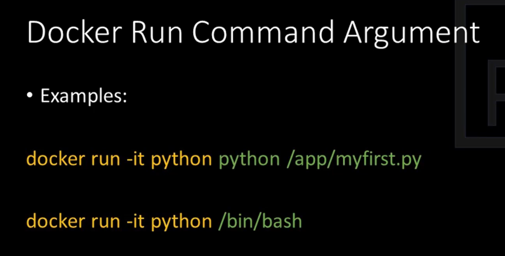
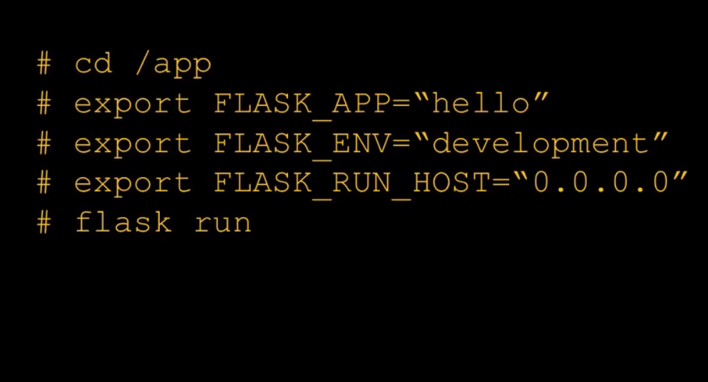

# Python app in docker container
```
$ cd simple-flask
$ sudo docker build -t johnderasia/simple-flask:v1.0 .
$ sudo docker run --rm -it -p 5001:5000 johnderasia/simple-flask:v1.0
```


# Shipping image to Docker Hub
```
$ sudo docker login --username=johnderasia
$ sudo docker push johnderasia/simple-flask:v1.0
```


# Running app on AWS
```
$ sudo docker-machine create --driver amazonec2 --amazonec2-open-port 5000 --amazonec2-region eu-west3 aws-machine
$ sudo docker-machine env aws-machine
$ bash
$ eval $(docker-machine env aws-machine)
$ docker-machine ip aws-machine
$ docker run --rm -it -p 5001:5000 johnderasia/simple-flask:v1.0
```

## delete the ec2
```
$ sudo docker-machine rm aws-machine
```

# Docker on Linux - Security Warning
- docker only runs with root privilege
> user in the docker group can add themselves to sudoers and also modify host
```
$ docker run -it --rm -v /:/host centos chroot /host
```

# Lauch python interpreter from docker
## pull python image
```
$ sudo docker image pull python
```
## create container
```
$ sudo docker container create --tty --interactive python
```
## list the created container
```
$ sudo docker container ps --all
CONTAINER ID        IMAGE                 COMMAND                  CREATED              STATUS                     PORTS               NAMES
6e760fc8e2a8        python                "python3"                About a minute ago   Created                                        practical_villani
```
## rename the container
```
$ sudo docker container rename practical_villani mypython

$ sudo docker container ps --all
CONTAINER ID        IMAGE                 COMMAND                  CREATED             STATUS                     PORTS               NAMES
6e760fc8e2a8        python                "python3"                3 minutes ago       Created                                        mypython
```
## use the container
```
$ sudo docker container start --interactive mypython
Python 3.8.3 (default, May 16 2020, 07:08:28) 
[GCC 8.3.0] on linux
Type "help", "copyright", "credits" or "license" for more information.
>>> 
```
## get hostname and exit with 99 code
```
$ sudo docker container start --interactive mypython
Python 3.8.3 (default, May 16 2020, 07:08:28) 
[GCC 8.3.0] on linux
Type "help", "copyright", "credits" or "license" for more information.
>>> import socket
>>> print(socket.gethostname())
6e760fc8e2a8
>>> 
>>> exit(99)

$ sudo docker container ps --all
CONTAINER ID        IMAGE                 COMMAND                  CREATED             STATUS                      PORTS               NAMES
6e760fc8e2a8        python                "python3"                7 minutes ago       Exited (99) 4 seconds ago                       mypython
```
## delete the container
```
$ sudo docker container rm mypython

$ sudo docker container ps --all
CONTAINER ID        IMAGE                 COMMAND                  CREATED             STATUS                     PORTS               NAMES
```
## delete the python image
```
$ sudo docker rmi python
```

# Command Abbreviations


## run container and download image if not in local storage
```
$ sudo docker run -it --name mypython python
```

# Intergrating Containers with Host System

```
$ git clone https://github.com/pythonincontainers/myfirst.git
$ cd myfirst
$ cat myfirst.py
print('Python in Containers! Version 1')
```


## modify myfirst.py
```
$ vim myfirst.py
$ cat myfirst.py
print('Python in Containers! Version 2000')
```
## Mount directory that has source code into container
```
$ sudo docker run -it --name mypython -v ${PWD}:/app python
Python 3.8.3 (default, May 16 2020, 07:08:28) 
[GCC 8.3.0] on linux
Type "help", "copyright", "credits" or "license" for more information.
>>> exec(open('/app/myfirst.py').read())
Python in Containers! Version 2000
>>>
```
## Run Command Argument

## modify myfirst.py again
```
$ vim myfirst.py
$ cat myfirst.py
print('Python in Containers! Version 2000.0')
```
## run docker container with argument
```
$ sudo docker run -it --name myfirst -v ${PWD}:/app python /app/myfirst.py
Python in Containers! Version 2000,0
```
## we can use start to see the output each time we modify myfirst.py
```
$ sudo docker start -i myfirst
Python in Containers! Version 3
```
## start second container
```
$ sudo docker run -it --name mysecond -v ${PWD}:/app python /app/mysecond.py
Python in Containers!
What is your name? kris
Greetings kris
```
## more interactive when started with plain shell promt
```
$ sudo docker run -it --name mypython -v ${PWD}:/app python /bin/bash
root@ffa2999f1926:/# cd /app
root@ffa2999f1926:/app# python mysecond.py 
Python in Containers!
What is your name? kris
Greetings kris
root@ffa2999f1926:/app#
```
# Bind port

## execute flask in container
```
$ sudo docker run -it --name mypython -v ${PWD}:/app -p 5001:5000 python /bin/bash
root@2922078afc21:/# cd /app
root@2922078afc21:/app# pip install flask
Collecting flask
  Downloading Flask-1.1.2-py2.py3-none-any.whl (94 kB)
     |████████████████████████████████| 94 kB 369 kB/s 
Collecting itsdangerous>=0.24
  Downloading itsdangerous-1.1.0-py2.py3-none-any.whl (16 kB)
Collecting Werkzeug>=0.15
  Downloading Werkzeug-1.0.1-py2.py3-none-any.whl (298 kB)
     |████████████████████████████████| 298 kB 3.4 MB/s 
Collecting click>=5.1
  Downloading click-7.1.2-py2.py3-none-any.whl (82 kB)
     |████████████████████████████████| 82 kB 189 kB/s 
Collecting Jinja2>=2.10.1
  Downloading Jinja2-2.11.2-py2.py3-none-any.whl (125 kB)
     |████████████████████████████████| 125 kB 3.3 MB/s 
Collecting MarkupSafe>=0.23
  Downloading MarkupSafe-1.1.1-cp38-cp38-manylinux1_x86_64.whl (32 kB)
Installing collected packages: itsdangerous, Werkzeug, click, MarkupSafe, Jinja2, flask
Successfully installed Jinja2-2.11.2 MarkupSafe-1.1.1 Werkzeug-1.0.1 click-7.1.2 flask-1.1.2 itsdangerous-1.1.0
root@2922078afc21:/app# 
root@2922078afc21:/app# export FLASK_DEBUG=1
root@2922078afc21:/app# export FLASK_APP=mythird.py
root@2922078afc21:/app# flask run --host=0.0.0.0
 * Serving Flask app "mythird.py" (lazy loading)
 * Environment: production
   WARNING: This is a development server. Do not use it in a production deployment.
   Use a production WSGI server instead.
 * Debug mode: on
 * Running on http://0.0.0.0:5000/ (Press CTRL+C to quit)
 * Restarting with stat
 * Debugger is active!
 * Debugger PIN: 105-860-997
```
## access 127.0.0.1:5001 from host browser

# Summary Intergrating Containers with Host System


# Container Images
## Image Start-up Command


```
$ sudo docker run pythonincontainers/entrypoint
one two three

$ sudo docker run pythonincontainers/entrypoint four five six
one four five six
```


```
$ sudo docker inspect --format "ENTRYPOINT={{.Config.Entrypoint}} CMD={{.Config.Cmd}}" pythonincontainers/entrypoint
ENTRYPOINT=[echo one] CMD=[two three]

$ sudo docker inspect --format "ENTRYPOINT={{.Config.Entrypoint}} CMD={{.Config.Cmd}}" python
ENTRYPOINT=[] CMD=[python3]

$ sudo docker inspect --format "ENTRYPOINT={{.Config.Entrypoint}} CMD={{.Config.Cmd}}" centos
ENTRYPOINT=[] CMD=[/bin/bash]

$ sudo docker pull nginx
$ sudo docker inspect --format "ENTRYPOINT={{.Config.Entrypoint}} CMD={{.Config.Cmd}}" nginx
ENTRYPOINT=[/docker-entrypoint.sh] CMD=[nginx -g daemon off;]

$ sudo docker pull postgres
$ sudo docker inspect --format "ENTRYPOINT={{.Config.Entrypoint}} CMD={{.Config.Cmd}}" postgres
ENTRYPOINT=[docker-entrypoint.sh] CMD=[postgres]
```

## overwrite entry point
```
$ sudo docker run --rm --entrypoint date centos
Wed Jun 10 16:43:52 UTC 2020
```

# Managing Containers

## interactive and non interactive

```
$ sudo docker run -d -p 5000:5000 --name simple-flask pythonincontainers/simple-flask
```

## interact with detached container
```
$ sudo docker logs simple-flask
 * Serving Flask app "hello" (lazy loading)
 * Environment: production
   WARNING: Do not use the development server in a production environment.
   Use a production WSGI server instead.
 * Debug mode: off
 * Running on http://0.0.0.0:5000/ (Press CTRL+C to quit)
```
## tail the logs
```
$ sudo docker logs -t -f simple-flask
2020-06-11T02:19:53.637968644Z  * Serving Flask app "hello" (lazy loading)
2020-06-11T02:19:53.638053236Z  * Environment: production
2020-06-11T02:19:53.638064418Z    WARNING: Do not use the development server in a production environment.
2020-06-11T02:19:53.638091376Z    Use a production WSGI server instead.
2020-06-11T02:19:53.638100957Z  * Debug mode: off
2020-06-11T02:19:53.781179927Z  * Running on http://0.0.0.0:5000/ (Press CTRL+C to quit)
2020-06-11T02:22:08.065403094Z 172.17.0.1 - - [11/Jun/2020 02:22:08] "GET / HTTP/1.1" 200 -
```
## run adhoc commands on running container
```
$ sudo docker ps -a
CONTAINER ID        IMAGE                             COMMAND                  CREATED             STATUS              PORTS                    NAMES
56a49f92bd7e        pythonincontainers/simple-flask   "/bin/sh -c 'python …"   4 minutes ago       Up 4 minutes        0.0.0.0:5000->5000/tcp   simple-flask

$ sudo docker exec simple-flask ps -ef
UID        PID  PPID  C STIME TTY          TIME CMD
root         1     0  0 02:19 ?        00:00:00 /bin/sh -c python hello.py
root         6     1  0 02:19 ?        00:00:00 python hello.py
root         8     0  2 02:24 ?        00:00:00 ps -ef

$ sudo docker exec -it simple-flask bash
root@56a49f92bd7e:/usr/src/app# 
```

## Limit Container Resources

### Limit memory
```
$ sudo docker run -it -m 100m --memory-swap 100m python bash
root@1981990bd882:/# pip install numpy
Collecting numpy
  Downloading numpy-1.18.5-cp38-cp38-manylinux1_x86_64.whl (20.6 MB)
     |████████████████████████████████| 20.6 MB 45 kB/s 
Installing collected packages: numpy
Successfully installed numpy-1.18.5
root@1981990bd882:/# python
Python 3.8.3 (default, Jun  9 2020, 17:39:39) 
[GCC 8.3.0] on linux
Type "help", "copyright", "credits" or "license" for more information.
>>> import numpy
>>> result = [numpy.random.bytes(1024*1024) for x in range(10240)]
Killed
root@1981990bd882:/#

$ sudo docker stats
CONTAINER ID        NAME                CPU %               MEM USAGE / LIMIT     MEM %               NET I/O             BLOCK I/O           PIDS
1981990bd882        pedantic_cray       24.00%              99.37MiB / 100MiB     99.37%              21.8MB / 487kB      300MB / 14.9GB      5
```
### Limit CPU
```
$ sudo docker run -it -m 100m --memory-swap 100m --cpus 0.1 python bash
```
## Remove containers
```
$ sudo docker ps -a
CONTAINER ID        IMAGE                             COMMAND                  CREATED             STATUS                       PORTS                    NAMES
6442ef2f8a2c        python                            "bash"                   6 minutes ago       Exited (130) 9 seconds ago                            tender_brattain
1981990bd882        python                            "bash"                   17 minutes ago      Exited (137) 7 minutes ago                            pedantic_cray
56a49f92bd7e        pythonincontainers/simple-flask   "/bin/sh -c 'python …"   29 minutes ago      Up 29 minutes                0.0.0.0:5000->5000/tcp   simple-flask

$ sudo docker rm -f $(sudo docker ps -a -q)
6442ef2f8a2c
1981990bd882
56a49f92bd7e
```

# Running Multiple Containers
> Needs proper networking
```
$ sudo docker run -d -p 5000:5000 --name simple-flask pythonincontainers/simple-flask
```
## Access flask app from host
```
$ curl 127.0.0.1:5000
Flask Hello world! Version 1
```

## Access flask app from another container
```
$ sudo docker run -it --name centos centos
[root@8d8a9f3243ac /]# curl 127.0.0.1:5000
curl: (7) Failed to connect to 127.0.0.1 port 5000: Connection refused
```

## get containers IP
```
$ sudo docker inspect --format "{{.NetworkSettings.IPAddress}}" simple-flask
172.17.0.2
$ sudo docker inspect --format "{{.NetworkSettings.IPAddress}}" centos
172.17.0.3
```

## Access flask app from another container using IP
```
$ sudo docker run -it --name centos centos
[root@71a732cba418 /]# curl 172.17.0.2:5000
Flask Hello world! Version 1
```

## Add simple-flask to /etc/hosts of container
```
$ sudo docker run --rm -it --name centos --add-host simple-flask:172.17.0.2 centos
[root@d11c21c5d670 /]# cat /etc/hosts
127.0.0.1	localhost
::1	localhost ip6-localhost ip6-loopback
fe00::0	ip6-localnet
ff00::0	ip6-mcastprefix
ff02::1	ip6-allnodes
ff02::2	ip6-allrouters
172.17.0.2	simple-flask
172.17.0.3	d11c21c5d670
[root@d11c21c5d670 /]# 
[root@d11c21c5d670 /]# curl simple-flask:5000 
Flask Hello world! Version 1
```


## Add vnet
> Use virtual network vnet to group all containers in one network and all the containers will be able to talk with each another using hostnames

## Create virtual network
```
$ sudo docker network create my-vnet
```

## Add containers to the virtual network and access flask
```
$ sudo docker run -d --name simple-flask --network my-vnet pythonincontainers/simple-flask

$ sudo docker run --rm -it --name centos --network my-vnet centos
[root@29ca1ef0e206 /]# curl simple-flask:5000
Flask Hello world! Version 1
```

## setup postgress database container and access it using pgadmin container


```
$ sudo docker run -d --name posgres --network my-vnet --env "POSTGRES_PASSWORD=mysecret" postgres

$ sudo docker logs --tail 1 posgres
2020-06-11 04:35:36.327 UTC [1] LOG:  database system is ready to accept connections

$ sudo docker run -d --name pgadmin --network my-vnet -e "PGADMIN_DEFAULT_EMAIL=user@example.com" -e "PGADMIN_DEFAULT_PASSWORD=supersecret" -p 8088:80 dpage/pgadmin4
```

## Access pgadmin from host


## set connection to postgres database


## create new database called mydatabase


## use sqlalchemy to update database
```
$ git clone https://github.com/pythonincontainers/sqlalchemy-psql.git

$ docker run --rm -it -v ${PWD}:/app --network my-vnet python bash
root@a78db869ffbc:/# cd /app/
root@a78db869ffbc:/app# pip install -r requirements.txt 
Collecting psycopg2
  Downloading psycopg2-2.8.5.tar.gz (380 kB)
     |████████████████████████████████| 380 kB 150 kB/s 
Collecting sqlalchemy
  Downloading SQLAlchemy-1.3.17-cp38-cp38-manylinux2010_x86_64.whl (1.3 MB)
     |████████████████████████████████| 1.3 MB 423 kB/s 
Building wheels for collected packages: psycopg2
  Building wheel for psycopg2 (setup.py) ... done
  Created wheel for psycopg2: filename=psycopg2-2.8.5-cp38-cp38-linux_x86_64.whl size=500518 sha256=6461212f046740f647308dadc8fa2c4fbb57552d4afdec81ada8199c787be9b7
  Stored in directory: /root/.cache/pip/wheels/35/64/21/9c9e2c1bb9cd6bca3c1b97b955615e37fd309f8e8b0b9fdf1a
Successfully built psycopg2
Installing collected packages: psycopg2, sqlalchemy
Successfully installed psycopg2-2.8.5 sqlalchemy-1.3.17
root@a78db869ffbc:/app# 
root@a78db869ffbc:/app# python alchemy-psql.py
```

## person table created and populated with data from alchemy-psql.py


# Container Networking
## View all networks
```
$ docker network ls
NETWORK ID          NAME                   DRIVER              SCOPE
f094375d36c6        bridge                 bridge              local
46d548312e32        frappedocker_default   bridge              local
67f31866166a        host                   host                local
0fcf8cac2e33        my-net                 bridge              local
978b606f5105        my-vnet                bridge              local
2275499b573c        none                   null                local
489fcda7f785        snakeeyes_default      bridge              local
```
## delete network
```
$ docker network rm my-net
my-net
```
## custom subnet
```
$ docker network create --subnet 10.10.0.0/16 my-addr

$ docker run --rm -it --name alpine1 --network my-addr alpine
/ # ifconfig 
eth0      Link encap:Ethernet  HWaddr 02:42:0A:0A:00:02  
          inet addr:10.10.0.2  Bcast:10.10.255.255  Mask:255.255.0.0
          UP BROADCAST RUNNING MULTICAST  MTU:1500  Metric:1
          RX packets:52 errors:0 dropped:0 overruns:0 frame:0
          TX packets:0 errors:0 dropped:0 overruns:0 carrier:0
          collisions:0 txqueuelen:0 
          RX bytes:6851 (6.6 KiB)  TX bytes:0 (0.0 B)

lo        Link encap:Local Loopback  
          inet addr:127.0.0.1  Mask:255.0.0.0
          UP LOOPBACK RUNNING  MTU:65536  Metric:1
          RX packets:0 errors:0 dropped:0 overruns:0 frame:0
          TX packets:0 errors:0 dropped:0 overruns:0 carrier:0
          collisions:0 txqueuelen:1000 
          RX bytes:0 (0.0 B)  TX bytes:0 (0.0 B)

/ # 
```
## start another container
```
$ docker run --rm -it --name alpine2 alpine
/ # ifconfig 
eth0      Link encap:Ethernet  HWaddr 02:42:AC:11:00:02  
          inet addr:172.17.0.2  Bcast:172.17.255.255  Mask:255.255.0.0
          UP BROADCAST RUNNING MULTICAST  MTU:1500  Metric:1
          RX packets:26 errors:0 dropped:0 overruns:0 frame:0
          TX packets:0 errors:0 dropped:0 overruns:0 carrier:0
          collisions:0 txqueuelen:0 
          RX bytes:3142 (3.0 KiB)  TX bytes:0 (0.0 B)

lo        Link encap:Local Loopback  
          inet addr:127.0.0.1  Mask:255.0.0.0
          UP LOOPBACK RUNNING  MTU:65536  Metric:1
          RX packets:0 errors:0 dropped:0 overruns:0 frame:0
          TX packets:0 errors:0 dropped:0 overruns:0 carrier:0
          collisions:0 txqueuelen:1000 
          RX bytes:0 (0.0 B)  TX bytes:0 (0.0 B)

 
```
## connect alpine2 to my-addr network
```
$ docker network connect my-addr alpine2
```
## ifconfig on alpine2 again
```
/ # ifconfig 
eth0      Link encap:Ethernet  HWaddr 02:42:AC:11:00:02  
          inet addr:172.17.0.2  Bcast:172.17.255.255  Mask:255.255.0.0
          UP BROADCAST RUNNING MULTICAST  MTU:1500  Metric:1
          RX packets:28 errors:0 dropped:0 overruns:0 frame:0
          TX packets:0 errors:0 dropped:0 overruns:0 carrier:0
          collisions:0 txqueuelen:0 
          RX bytes:3319 (3.2 KiB)  TX bytes:0 (0.0 B)

eth1      Link encap:Ethernet  HWaddr 02:42:0A:0A:00:03  
          inet addr:10.10.0.3  Bcast:10.10.255.255  Mask:255.255.0.0
          UP BROADCAST RUNNING MULTICAST  MTU:1500  Metric:1
          RX packets:14 errors:0 dropped:0 overruns:0 frame:0
          TX packets:0 errors:0 dropped:0 overruns:0 carrier:0
          collisions:0 txqueuelen:0 
          RX bytes:1798 (1.7 KiB)  TX bytes:0 (0.0 B)

lo        Link encap:Local Loopback  
          inet addr:127.0.0.1  Mask:255.0.0.0
          UP LOOPBACK RUNNING  MTU:65536  Metric:1
          RX packets:0 errors:0 dropped:0 overruns:0 frame:0
          TX packets:0 errors:0 dropped:0 overruns:0 carrier:0
          collisions:0 txqueuelen:1000 
          RX bytes:0 (0.0 B)  TX bytes:0 (0.0 B)

/ #
```

## create LAN only network
```
$ docker network create --internal int-net

$ docker run -dit --name int1 --network int-net alpine

$ docker run -dit --name int2 --network int-net alpine
```

# Data Persistency - Volumes
> docker container are stateless
> file will exist as long container exists

```
$ docker run -it --name mypython python bash
root@709220a34b5e:/# mkdir /app
root@709220a34b5e:/# cd /app
root@709220a34b5e:/app# touch hi.txt
root@709220a34b5e:/app# 
root@709220a34b5e:/app# exit

$ docker start -i mypython
root@709220a34b5e:/# ls -l /app/hi.txt 
-rw-r--r-- 1 root root 0 Jun 11 15:25 /app/hi.txt
root@709220a34b5e:/# exit

$ docker rm mypython

$ docker run -it --name mypython python bash
root@3d7cd75e7cbb:/# ls -l /app/hi.txt
ls: cannot access '/app/hi.txt': No such file or directory
```

## create volume
```
$ docker volume create my-vol
```
## volume location
```
$ docker volume inspect my-vol
[
    {
        "CreatedAt": "2020-06-11T23:33:08+08:00",
        "Driver": "local",
        "Labels": {},
        "Mountpoint": "/var/lib/docker/volumes/my-vol/_data",
        "Name": "my-vol",
        "Options": {},
        "Scope": "local"
    }
]
```

## create container with volume
```
$ docker run -it --name mypyhon --volume my-vol:/app python bash
root@7ff61074210a:/# 
root@7ff61074210a:/# cd /app
root@7ff61074210a:/app# touch hi.txt
root@7ff61074210a:/app# exit

$ docker rm mypyhon

$ docker run -it --name mypyhon --volume my-vol:/app python bash
root@39beaf9e14c0:/# ls -l /app/hi.txt 
-rw-r--r-- 1 root root 0 Jun 11 15:33 /app/hi.txt
```

## delete volume
```
$ docker volume rm my-vol
```

## Docker Bind Mount for local development

```
$ docker run --rm -it -v ${PWD}:/app python bash
root@59ae5351082e:/# touch /app/hello.txt
root@59ae5351082e:/# exit

$ ls -l hello.txt 
-rw-r--r-- 1 root root 0 Jun  11 23:41 hello.txt
```

# Dockerfile Introduction
```
$ git clone https://github.com/pythonincontainers/flask-hello.git

$ cd flask-hello

$ docker run --rm -it -p 5000:5000 -v ${PWD}:/app python bash
root@0a1fdfc71b14:/# cd /app/
root@0a1fdfc71b14:/app# pip install Flask
Collecting Flask
  Downloading Flask-1.1.2-py2.py3-none-any.whl (94 kB)
     |████████████████████████████████| 94 kB 329 kB/s 
Collecting Jinja2>=2.10.1
  Downloading Jinja2-2.11.2-py2.py3-none-any.whl (125 kB)
     |████████████████████████████████| 125 kB 1.8 MB/s 
Collecting click>=5.1
  Downloading click-7.1.2-py2.py3-none-any.whl (82 kB)
     |████████████████████████████████| 82 kB 129 kB/s 
Collecting Werkzeug>=0.15
  Downloading Werkzeug-1.0.1-py2.py3-none-any.whl (298 kB)
     |████████████████████████████████| 298 kB 700 kB/s 
Collecting itsdangerous>=0.24
  Downloading itsdangerous-1.1.0-py2.py3-none-any.whl (16 kB)
Collecting MarkupSafe>=0.23
  Downloading MarkupSafe-1.1.1-cp38-cp38-manylinux1_x86_64.whl (32 kB)
Installing collected packages: MarkupSafe, Jinja2, click, Werkzeug, itsdangerous, Flask
Successfully installed Flask-1.1.2 Jinja2-2.11.2 MarkupSafe-1.1.1 Werkzeug-1.0.1 click-7.1.2 itsdangerous-1.1.0
root@0a1fdfc71b14:/app# export FLASK_DEBUG=True
root@0a1fdfc71b14:/app# python flask-hello.py 
 * Serving Flask app "flask-hello" (lazy loading)
 * Environment: production
   WARNING: This is a development server. Do not use it in a production deployment.
   Use a production WSGI server instead.
 * Debug mode: off
 * Running on http://0.0.0.0:5000/ (Press CTRL+C to quit)
```

> Problem too many to steps to start flask

## Solution use docker build instead

```
$ cat Dockerfile
FROM python
WORKDIR /myproject
COPY . .
RUN pip install -r requirements.txt
EXPOSE 5000
ENV FLASK_DEBUG=True
CMD python flask-hello.py
```
## Build the image in the current directory with name flask-hello:1.0
```
$ docker build -t flask-hello:1.0 .
Sending build context to Docker daemon  43.01kB
Step 1/7 : FROM python
 ---> 7f5b6ccd03e9
Step 2/7 : WORKDIR /myproject
Removing intermediate container 72c722095cf4
 ---> a7c863a65188
Step 3/7 : COPY . .
 ---> fd18e75d6eae
Step 4/7 : RUN pip install -r requirements.txt
 ---> Running in 7e8b8ef3c6e0
Collecting Flask
  Downloading Flask-1.1.2-py2.py3-none-any.whl (94 kB)
Collecting click>=5.1
  Downloading click-7.1.2-py2.py3-none-any.whl (82 kB)
Collecting itsdangerous>=0.24
  Downloading itsdangerous-1.1.0-py2.py3-none-any.whl (16 kB)
Collecting Jinja2>=2.10.1
  Downloading Jinja2-2.11.2-py2.py3-none-any.whl (125 kB)
Collecting Werkzeug>=0.15
  Downloading Werkzeug-1.0.1-py2.py3-none-any.whl (298 kB)
Collecting MarkupSafe>=0.23
  Downloading MarkupSafe-1.1.1-cp38-cp38-manylinux1_x86_64.whl (32 kB)
Installing collected packages: click, itsdangerous, MarkupSafe, Jinja2, Werkzeug, Flask
Successfully installed Flask-1.1.2 Jinja2-2.11.2 MarkupSafe-1.1.1 Werkzeug-1.0.1 click-7.1.2 itsdangerous-1.1.0
Removing intermediate container 7e8b8ef3c6e0
 ---> b6297fe84ecc
Step 5/7 : EXPOSE 5000
 ---> Running in d089c4609090
Removing intermediate container d089c4609090
 ---> 28a81b596bd3
Step 6/7 : ENV FLASK_DEBUG=True
 ---> Running in ac59960df036
Removing intermediate container ac59960df036
 ---> 9b16d204150c
Step 7/7 : CMD python flask-hello.py
 ---> Running in 17dd2a500779
Removing intermediate container 17dd2a500779
 ---> 84d85df2f4ae
Successfully built 84d85df2f4ae
Successfully tagged flask-hello:1.0
```
## Execute the created image
> -P will automatically expose default ports
```
$ docker run -d -P --name flask-hello flask-hello:1.0
68cfbe68fa5f5ab12ab7c46fdcad25ff33fabf315621d8c90730fcce8ae9a1dd

$ docker ps
CONTAINER ID        IMAGE               COMMAND                  CREATED              STATUS              PORTS                     NAMES
68cfbe68fa5f        flask-hello:1.0     "/bin/sh -c 'python …"   About a minute ago   Up About a minute   0.0.0.0:32768->5000/tcp   flask-hello

$ curl 0.0.0.0:32768
Flask Hello world! Version 3
```

## build image algorithm


# Build Container Images


# Manual Image Build Process

```
$ mkdir manual-build

$ cd manual-build

$ vim hello.py
```
```py
# hello.py
from flask import Flask

app = Flask(__name__)


@app.route('/')
def hello():
    return 'Hello, World!'
```
## create script for the following commands

```
$ vim start-app.sh
cd /app
export FLASK_APP='hello'
export FLASK_ENV='development'
export FLASK_RUN_HOST='0.0.0.0'
flask run

$ docker create -it --name manual -p 5000:5000 python /bin/sh
186d22242bba8cd1731b349ed5dfaced77d72061c4f024e79be1fa43c36b05f3

$ docker start -i manual
# mkdir /app
# exit

$ docker cp hello.py manual:/app

$ docker cp start-app.sh manual:/app

$ docker start -i manual
# cd /app
# ls
hello.py  start-app.sh
# chmod +x start-app.sh	
# pip install Flask
Collecting Flask
  Downloading Flask-1.1.2-py2.py3-none-any.whl (94 kB)
     |████████████████████████████████| 94 kB 376 kB/s 
Collecting Werkzeug>=0.15
  Downloading Werkzeug-1.0.1-py2.py3-none-any.whl (298 kB)
     |████████████████████████████████| 298 kB 3.3 MB/s 
Collecting click>=5.1
  Downloading click-7.1.2-py2.py3-none-any.whl (82 kB)
     |████████████████████████████████| 82 kB 150 kB/s 
Collecting Jinja2>=2.10.1
  Downloading Jinja2-2.11.2-py2.py3-none-any.whl (125 kB)
     |████████████████████████████████| 125 kB 1.1 MB/s 
Collecting itsdangerous>=0.24
  Downloading itsdangerous-1.1.0-py2.py3-none-any.whl (16 kB)
Collecting MarkupSafe>=0.23
  Downloading MarkupSafe-1.1.1-cp38-cp38-manylinux1_x86_64.whl (32 kB)
Installing collected packages: Werkzeug, click, MarkupSafe, Jinja2, itsdangerous, Flask
Successfully installed Flask-1.1.2 Jinja2-2.11.2 MarkupSafe-1.1.1 Werkzeug-1.0.1 click-7.1.2 itsdangerous-1.1.0
# /app/start-app.sh
 * Serving Flask app "hello" (lazy loading)
 * Environment: development
 * Debug mode: on
 * Running on http://0.0.0.0:5000/ (Press CTRL+C to quit)
 * Restarting with stat
 * Debugger is active!
 * Debugger PIN: 124-729-936
```

```
$ curl 127.0.0.1:5000
Hello, World!
```

## create the image
```
$ docker commit --change "CMD /app/start-app.sh" manual manual-image:1.1
sha256:acc8438ea7edd92ce31ad883f4c67bf15256487bd2bbf8663e43c30b524ccdd9
```

## start the container
```
$ docker run -it --rm -p 5001:5000 manual-image:1.1
 * Serving Flask app "hello" (lazy loading)
 * Environment: development
 * Debug mode: on
 * Running on http://0.0.0.0:5000/ (Press CTRL+C to quit)
 * Restarting with stat
 * Debugger is active!
 * Debugger PIN: 326-685-887
```

## access the flask app
```
$ curl 127.0.0.1:5001
Hello, World!
```

# Dockerfile - Automation of Image Build


## create dockerfile
```
$ vim Dockerfile
# Base image
FROM python

# create the directory if doesn't exist and cd into it
WORKDIR /app

# copy hello.py and start-app.sh into app
COPY hello.py .
COPY start-app.sh .

# install flask
RUN pip install Flask

# startup command
CMD ["/bin/bash", "start-app.sh"]
```
## build the image
```
$ docker build -t automated-image:1.0 .
Sending build context to Docker daemon  4.096kB
Step 1/6 : FROM python
 ---> 7f5b6ccd03e9
Step 2/6 : WORKDIR /app
Removing intermediate container 35f0d9663629
 ---> 0bf09ddfbb31
Step 3/6 : COPY hello.py .
 ---> 976201cd2631
Step 4/6 : COPY start-app.sh .
 ---> e680edc52eba
Step 5/6 : RUN pip install Flask
 ---> Running in 2f8067f6edfc
Collecting Flask
  Downloading Flask-1.1.2-py2.py3-none-any.whl (94 kB)
Collecting click>=5.1
  Downloading click-7.1.2-py2.py3-none-any.whl (82 kB)
Collecting Jinja2>=2.10.1
  Downloading Jinja2-2.11.2-py2.py3-none-any.whl (125 kB)
Collecting Werkzeug>=0.15
  Downloading Werkzeug-1.0.1-py2.py3-none-any.whl (298 kB)
Collecting itsdangerous>=0.24
  Downloading itsdangerous-1.1.0-py2.py3-none-any.whl (16 kB)
Collecting MarkupSafe>=0.23
  Downloading MarkupSafe-1.1.1-cp38-cp38-manylinux1_x86_64.whl (32 kB)
Installing collected packages: click, MarkupSafe, Jinja2, Werkzeug, itsdangerous, Flask
Successfully installed Flask-1.1.2 Jinja2-2.11.2 MarkupSafe-1.1.1 Werkzeug-1.0.1 click-7.1.2 itsdangerous-1.1.0
Removing intermediate container 2f8067f6edfc
 ---> 007c6e6bd2bb
Step 6/6 : CMD ["/bin/bash", "start-app.sh"]
 ---> Running in d50dac6daac9
Removing intermediate container d50dac6daac9
 ---> bb841ecf66a2
Successfully built bb841ecf66a2
Successfully tagged automated-image:1.0
```
## start the container
```
$ docker run -it --rm -p 5000:5000 automated-image:1.0
 * Serving Flask app "hello" (lazy loading)
 * Environment: development
 * Debug mode: on
 * Running on http://0.0.0.0:5000/ (Press CTRL+C to quit)
 * Restarting with stat
 * Debugger is active!
 * Debugger PIN: 291-337-079
```
## access the flask app
```
$ curl 127.0.0.1:5000
Hello, World!
```

## use ENV to drop start-app.sh
```
$ vim Dockerfile.env
# Base image
FROM python

# create the directory if doesn't exist and cd into it
WORKDIR /app

# copy hello.py into app
COPY hello.py .

# install flask
RUN pip install Flask

# environment variables
ENV FLASK_APP "hello"
ENV FLASK_ENV "development"
ENV FLASK_RUN_HOST "0.0.0.0"

# startup command
CMD ["flask", "run"]
```

## build the image
```
$ docker build -f Dockerfile.env -t automated-image:1.1 .
Sending build context to Docker daemon   5.12kB
Step 1/8 : FROM python
 ---> 7f5b6ccd03e9
Step 2/8 : WORKDIR /app
 ---> Using cache
 ---> 0bf09ddfbb31
Step 3/8 : COPY hello.py .
 ---> Using cache
 ---> 976201cd2631
Step 4/8 : RUN pip install Flask
 ---> Running in 44dae9cd4e14
Collecting Flask
  Downloading Flask-1.1.2-py2.py3-none-any.whl (94 kB)
Collecting click>=5.1
  Downloading click-7.1.2-py2.py3-none-any.whl (82 kB)
Collecting Jinja2>=2.10.1
  Downloading Jinja2-2.11.2-py2.py3-none-any.whl (125 kB)
Collecting itsdangerous>=0.24
  Downloading itsdangerous-1.1.0-py2.py3-none-any.whl (16 kB)
Collecting Werkzeug>=0.15
  Downloading Werkzeug-1.0.1-py2.py3-none-any.whl (298 kB)
Collecting MarkupSafe>=0.23
  Downloading MarkupSafe-1.1.1-cp38-cp38-manylinux1_x86_64.whl (32 kB)
Installing collected packages: click, MarkupSafe, Jinja2, itsdangerous, Werkzeug, Flask
Successfully installed Flask-1.1.2 Jinja2-2.11.2 MarkupSafe-1.1.1 Werkzeug-1.0.1 click-7.1.2 itsdangerous-1.1.0
Removing intermediate container 44dae9cd4e14
 ---> 3d568958a545
Step 5/8 : ENV FLASK_APP "hello"
 ---> Running in 16476195cdc0
Removing intermediate container 16476195cdc0
 ---> 3222487bd79b
Step 6/8 : ENV FLASK_ENV "development"
 ---> Running in 999f3795f3bd
Removing intermediate container 999f3795f3bd
 ---> 6fd8f84754b6
Step 7/8 : ENV FLASK_RUN_HOST "0.0.0.0"
 ---> Running in 5915b630f439
Removing intermediate container 5915b630f439
 ---> f2f8bd34686a
Step 8/8 : CMD ["flask", "run"]
 ---> Running in 763be9265a46
Removing intermediate container 763be9265a46
 ---> 07d1675e501c
Successfully built 07d1675e501c
Successfully tagged automated-image:1.1
```

## start the container
```
$ docker run -it --rm -p 5000:5000 automated-image:1.1
 * Serving Flask app "hello" (lazy loading)
 * Environment: development
 * Debug mode: on
 * Running on http://0.0.0.0:5000/ (Press CTRL+C to quit)
 * Restarting with stat
 * Debugger is active!
 * Debugger PIN: 109-373-717
```

## access the flask app
```
$ curl 127.0.0.1:5000
Hello, World!
```

## General flow


# Dockerfile Commands


# FROM commands


# WORKDIR commands


# COPY Commands


# Exclude with .dockerignore
> !include


## Exclude all except mysite and mysite_nginx.conf


# Docker build from github with Dockerfile in it

```
$ docker build -t flask-hello https://github.com/pythonincontainers/flask-hello.git
Sending build context to Docker daemon  122.9kB
Step 1/7 : FROM python
 ---> 7f5b6ccd03e9
Step 2/7 : WORKDIR /myproject
 ---> Using cache
 ---> a7c863a65188
Step 3/7 : COPY . .
 ---> ee8429c6fdb7
Step 4/7 : RUN pip install -r requirements.txt
 ---> Running in d78094ad7db2
Collecting Flask
  Downloading Flask-1.1.2-py2.py3-none-any.whl (94 kB)
Collecting Werkzeug>=0.15
  Downloading Werkzeug-1.0.1-py2.py3-none-any.whl (298 kB)
Collecting Jinja2>=2.10.1
  Downloading Jinja2-2.11.2-py2.py3-none-any.whl (125 kB)
Collecting click>=5.1
  Downloading click-7.1.2-py2.py3-none-any.whl (82 kB)
Collecting itsdangerous>=0.24
  Downloading itsdangerous-1.1.0-py2.py3-none-any.whl (16 kB)
Collecting MarkupSafe>=0.23
  Downloading MarkupSafe-1.1.1-cp38-cp38-manylinux1_x86_64.whl (32 kB)
Installing collected packages: Werkzeug, MarkupSafe, Jinja2, click, itsdangerous, Flask
Successfully installed Flask-1.1.2 Jinja2-2.11.2 MarkupSafe-1.1.1 Werkzeug-1.0.1 click-7.1.2 itsdangerous-1.1.0
Removing intermediate container d78094ad7db2
 ---> 4ccdb4b80a6f
Step 5/7 : EXPOSE 5000
 ---> Running in 894b85590ab5
Removing intermediate container 894b85590ab5
 ---> 29392b9a4df7
Step 6/7 : ENV FLASK_DEBUG=True
 ---> Running in af1b1e1ac7c1
Removing intermediate container af1b1e1ac7c1
 ---> 4083fb56f94c
Step 7/7 : CMD python flask-hello.py
 ---> Running in d7290c5cbcab
Removing intermediate container d7290c5cbcab
 ---> 223be43f6b40
Successfully built 223be43f6b40
Successfully tagged flask-hello:latest
```

# RUN commands
> only runs with non interactive command


## Change shell


## Common use of RUN commands


# ENV commands


## overwrite ENV value


# VOLUME commands


```
$ mkdir dockerfile-vol

$ cd dockerfile-vol

$ vim Dockerfile.vol
FROM python
VOLUME /data
COPY hello.py /data/

$ vim hello.py
print('hello')

$ docker build -t vol -f Dockerfile.vol .
Sending build context to Docker daemon  3.072kB
Step 1/3 : FROM python
 ---> 7f5b6ccd03e9
Step 2/3 : VOLUME /data
 ---> Running in 7bcffef21838
Removing intermediate container 7bcffef21838
 ---> 84219efb9453
Step 3/3 : COPY hello.py /data/
 ---> a988114fa379
Successfully built a988114fa379
Successfully tagged vol:latest

$ docker inspect -f "{{json .Config.Volumes}}" vol
{"/data":{}}

$ docker volume create data
data

$ docker run -it --name vol -v data:/data vol bash
root@595a8ca807a3:/# cd /data
root@595a8ca807a3:/data# ls 
hello.py
```

# EXPOSE command


# Start-up command CMD and ENTRYPOINT

```
$ mkdir dockerfile-cmd

$ cd dockerfile-cmd

$ vim Dockerfile.simple
FROM python
ENTRYPOINT ["python"]
CMD ["--version"]

$ docker build -t simple -f Dockerfile.simple .
Sending build context to Docker daemon  2.048kB
Step 1/3 : FROM python
 ---> 7f5b6ccd03e9
Step 2/3 : ENTRYPOINT ["python"]
 ---> Running in a64c08d49761
Removing intermediate container a64c08d49761
 ---> 2f5d991174c5
Step 3/3 : CMD ["--version"]
 ---> Running in 723451831e58
Removing intermediate container 723451831e58
 ---> f0c707326f39
Successfully built f0c707326f39
Successfully tagged simple:latest

$ docker run --rm simple
Python 3.8.3
```
## modify Dockerfile.simple
```
$ vim Dockerfile.simple
FROM python
ENTRYPOINT ["python"]
CMD ["-c", "print('Hello world')"]

$ docker build -t simple -f Dockerfile.simple .
Sending build context to Docker daemon  2.048kB
Step 1/3 : FROM python
 ---> 7f5b6ccd03e9
Step 2/3 : ENTRYPOINT ["python"]
 ---> Using cache
 ---> 2f5d991174c5
Step 3/3 : CMD ["-c", "print('Hello world')"]
 ---> Running in f41709de6423
Removing intermediate container f41709de6423
 ---> 611fcbb583fc
Successfully built 611fcbb583fc
Successfully tagged simple:latest

$ docker run --rm simple
Hello world
```

## Example
```
$ git clone https://github.com/pythonincontainers/entrypoint-cmd

$ cd entrypoint-cmd

$ vim simple_args.py
```
```py
# simple_args.py
import sys

print(sys.argv)
```

```
$ vim Dockerfile.simple_entry
FROM python
WORKDIR /app/
COPY simple_args.py /app/
ENTRYPOINT ["python"]
CMD ["simple_args.py"]

$ docker build -t simple_entry -f Dockerfile.simple_entry .
Sending build context to Docker daemon  9.216kB
Step 1/5 : FROM python
 ---> 7f5b6ccd03e9
Step 2/5 : WORKDIR /app/
Removing intermediate container 26642687888c
 ---> b71397b5009b
Step 3/5 : COPY simple_args.py /app/
 ---> 93de5aa1fcfa
Step 4/5 : ENTRYPOINT ["python"]
 ---> Running in 1ff0f050cd84
Removing intermediate container 1ff0f050cd84
 ---> d36a99957565
Step 5/5 : CMD ["simple_args.py"]
 ---> Running in e0dd6d4b018c
Removing intermediate container e0dd6d4b018c
 ---> a54fa9f28567
Successfully built a54fa9f28567
Successfully tagged simple_entry:latest


$ docker run --rm simple_entry
['simple_args.py']
```

## modify CMD, add more arguments
```
$ vim Dockerfile.simple_entry
FROM python
WORKDIR /app/
COPY simple_args.py /app/
ENTRYPOINT ["python"]
CMD ["simple_args.py", "one", "two"]

$ docker build -t simple_entry -f Dockerfile.simple_entry .
Sending build context to Docker daemon  9.216kB
Step 1/5 : FROM python
 ---> 7f5b6ccd03e9
Step 2/5 : WORKDIR /app/
 ---> Using cache
 ---> b71397b5009b
Step 3/5 : COPY simple_args.py /app/
 ---> Using cache
 ---> 93de5aa1fcfa
Step 4/5 : ENTRYPOINT ["python"]
 ---> Using cache
 ---> d36a99957565
Step 5/5 : CMD ["simple_args.py", "one", "two"]
 ---> Running in d4befa091cff
Removing intermediate container d4befa091cff
 ---> 65af99738a46
Successfully built 65af99738a46
Successfully tagged simple_entry:latest

$ docker run --rm simple_entry
['simple_args.py', 'one', 'two']
```

## remove CMD completely
```
$ vim Dockerfile.simple_entry
FROM python
WORKDIR /app/
COPY simple_args.py /app/
ENTRYPOINT ["python", "simple_args.py", "one", "two"]

$ docker build -t simple_entry -f Dockerfile.simple_entry .
Sending build context to Docker daemon  9.216kB
Step 1/4 : FROM python
 ---> 7f5b6ccd03e9
Step 2/4 : WORKDIR /app/
 ---> Using cache
 ---> b71397b5009b
Step 3/4 : COPY simple_args.py /app/
 ---> Using cache
 ---> 93de5aa1fcfa
Step 4/4 : ENTRYPOINT ["python", "simple_args.py", "one", "two"]
 ---> Running in 208505ebd974
Removing intermediate container 208505ebd974
 ---> 3d48056d09f7
Successfully built 3d48056d09f7
Successfully tagged simple_entry:latest

$ docker run --rm simple_entry
['simple_args.py', 'one', 'two']
```

## remove ENTRYPOINT and put everythin in CMD
```
$ vim Dockerfile.simple_entry
FROM python
WORKDIR /app/
COPY simple_args.py /app/
CMD ["python", "simple_args.py", "one", "two"]

$ docker build -t simple_entry -f Dockerfile.simple_entry .
Sending build context to Docker daemon  9.216kB
Step 1/4 : FROM python
 ---> 7f5b6ccd03e9
Step 2/4 : WORKDIR /app/
 ---> Using cache
 ---> b71397b5009b
Step 3/4 : COPY simple_args.py /app/
 ---> Using cache
 ---> 93de5aa1fcfa
Step 4/4 : CMD ["python", "simple_args.py", "one", "two"]
 ---> Running in 9bec5d8ce89e
Removing intermediate container 9bec5d8ce89e
 ---> d28ba56d8960
Successfully built d28ba56d8960
Successfully tagged simple_entry:latest

$ docker run --rm simple_entry
['simple_args.py', 'one', 'two']
```

## Run with diffrent entrypoint or overwrite it
```
$ docker run --rm --entrypoint python3 simple_entry simple_args.py five six seven
['simple_args.py', 'five', 'six', 'seven']
```

## start with /bin/sh
```
$ docker run -it --rm --entrypoint="" simple_entry /bin/sh
# 
```


```
$ vim Dockerfile.shell
FROM python
WORKDIR /app/
COPY simple_args.py /app/
CMD python simple_args.py one two
```
## build the image and inspect
```
$ docker build -t shell -f Dockerfile.shell .
Sending build context to Docker daemon  9.216kB
Step 1/4 : FROM python
 ---> 7f5b6ccd03e9
Step 2/4 : WORKDIR /app/
 ---> Using cache
 ---> b71397b5009b
Step 3/4 : COPY simple_args.py /app/
 ---> Using cache
 ---> 93de5aa1fcfa
Step 4/4 : CMD python simple_args.py one two
 ---> Running in b69ed0856f23
Removing intermediate container b69ed0856f23
 ---> a8789e62f93d
Successfully built a8789e62f93d
Successfully tagged shell:latest

$ docker inspect -f "ENTRYPOINT={{.Config.Entrypoint}} CMD={{.Config.Cmd}}" shell
ENTRYPOINT=[] CMD=[/bin/sh -c python simple_args.py one two]
```

# ARG command
> parametrizing docker files to change versions easily insted of modifying dockerfiles

> if NO --arg file the default values will be used

```
$ git clone https://github.com/pythonincontainers/dockerfile-arg

$ cd dockerfile-arg

$ cat Dockerfile.arg 
ARG Python_Image_Name=python
ARG Python_Image_Tag=latest
FROM $Python_Image_Name:$Python_Image_Tag
ARG Flask_Ver=1.0.2
RUN pip install flask==$Flask_Ver
WORKDIR /app
COPY hello-v2.py .
CMD ["python","hello-v2.py"]
```

## change flask version to 1.0.0
```
$ docker build -t args -f Dockerfile.arg --build-arg Flask_Ver=1.0.0 .
Sending build context to Docker daemon  44.03kB
Step 1/8 : ARG Python_Image_Name=python
Step 2/8 : ARG Python_Image_Tag=latest
Step 3/8 : FROM $Python_Image_Name:$Python_Image_Tag
 ---> 7f5b6ccd03e9
Step 4/8 : ARG Flask_Ver=1.0.2
 ---> Running in ff790498180b
Removing intermediate container ff790498180b
 ---> 0c086adc10b8
Step 5/8 : RUN pip install flask==$Flask_Ver
 ---> Running in 4a901c89e82c
Collecting flask==1.0.0
  Downloading Flask-1.0-py2.py3-none-any.whl (97 kB)
Collecting itsdangerous>=0.24
  Downloading itsdangerous-1.1.0-py2.py3-none-any.whl (16 kB)
Collecting Jinja2>=2.10
  Downloading Jinja2-2.11.2-py2.py3-none-any.whl (125 kB)
Collecting Werkzeug>=0.14
  Downloading Werkzeug-1.0.1-py2.py3-none-any.whl (298 kB)
Collecting click>=5.1
  Downloading click-7.1.2-py2.py3-none-any.whl (82 kB)
Collecting MarkupSafe>=0.23
  Downloading MarkupSafe-1.1.1-cp38-cp38-manylinux1_x86_64.whl (32 kB)
Installing collected packages: itsdangerous, MarkupSafe, Jinja2, Werkzeug, click, flask
Successfully installed Jinja2-2.11.2 MarkupSafe-1.1.1 Werkzeug-1.0.1 click-7.1.2 flask-1.0 itsdangerous-1.1.0
Removing intermediate container 4a901c89e82c
 ---> 29e9fc479203
Step 6/8 : WORKDIR /app
Removing intermediate container 64c31f270c81
 ---> fc3f47e34917
Step 7/8 : COPY hello-v2.py .
 ---> 60894e424cf8
Step 8/8 : CMD ["python","hello-v2.py"]
 ---> Running in 04e3584f29ca
Removing intermediate container 04e3584f29ca
 ---> 32023db99fab
Successfully built 32023db99fab
Successfully tagged args:latest
```

## change flask version to 1.0.0 and python image to slim
```
$ docker build -t args -f Dockerfile.arg --build-arg Flask_Ver=1.0.0 --build-arg Python_Image_Tag=slim .
Sending build context to Docker daemon  44.03kB
Step 1/8 : ARG Python_Image_Name=python
Step 2/8 : ARG Python_Image_Tag=latest
Step 3/8 : FROM $Python_Image_Name:$Python_Image_Tag
slim: Pulling from library/python
8559a31e96f4: Already exists 
62e60f3ef11e: Pull complete 
93c8ae153782: Pull complete 
ea222f757df7: Pull complete 
e97d3933bbbe: Pull complete 
Digest: sha256:938fd520a888e9dbac3de374b8ba495cc50fe96440030264a40f733052001895
Status: Downloaded newer image for python:slim
 ---> 9d84edf35a0a
Step 4/8 : ARG Flask_Ver=1.0.2
 ---> Running in 5e23d0e9cb4b
Removing intermediate container 5e23d0e9cb4b
 ---> 4b9de26d72d3
Step 5/8 : RUN pip install flask==$Flask_Ver
 ---> Running in 8448121385d7
Collecting flask==1.0.0
  Downloading Flask-1.0-py2.py3-none-any.whl (97 kB)
Collecting Jinja2>=2.10
  Downloading Jinja2-2.11.2-py2.py3-none-any.whl (125 kB)
Collecting Werkzeug>=0.14
  Downloading Werkzeug-1.0.1-py2.py3-none-any.whl (298 kB)
Collecting click>=5.1
  Downloading click-7.1.2-py2.py3-none-any.whl (82 kB)
Collecting itsdangerous>=0.24
  Downloading itsdangerous-1.1.0-py2.py3-none-any.whl (16 kB)
Collecting MarkupSafe>=0.23
  Downloading MarkupSafe-1.1.1-cp38-cp38-manylinux1_x86_64.whl (32 kB)
Installing collected packages: MarkupSafe, Jinja2, Werkzeug, click, itsdangerous, flask
Successfully installed Jinja2-2.11.2 MarkupSafe-1.1.1 Werkzeug-1.0.1 click-7.1.2 flask-1.0 itsdangerous-1.1.0
Removing intermediate container 8448121385d7
 ---> af0e74db87d5
Step 6/8 : WORKDIR /app
Removing intermediate container 14625c3b6035
 ---> 631218afbedd
Step 7/8 : COPY hello-v2.py .
 ---> 36e3aa57d3a4
Step 8/8 : CMD ["python","hello-v2.py"]
 ---> Running in 37166456526a
Removing intermediate container 37166456526a
 ---> 1c14e94a82f1
Successfully built 1c14e94a82f1
Successfully tagged args:latest
```
## Assign ARG variable to ENV variable to stored in metadata
```
$ cat Dockerfile.env 
ARG Python_Image_Name=python
ARG Python_Image_Tag=latest
FROM $Python_Image_Name:$Python_Image_Tag
ARG Flask_Ver=1.0.2
ARG Python_Image_Name=python
ARG Python_Image_Tag=latest
ENV PYTHON_IMAGE_NAME $Python_Image_Name
ENV PYTHON_IMAGE_TAG $Python_Image_Tag
ENV FLASK_VER $Flask_Ver
RUN pip install flask==$Flask_Ver
WORKDIR /app
COPY hello-v2.py .
CMD ["python","hello-v2.py"]

$ docker build -t args -f Dockerfile.env --build-arg Python_Image_Name=centos/python-36-centos7 .
```


