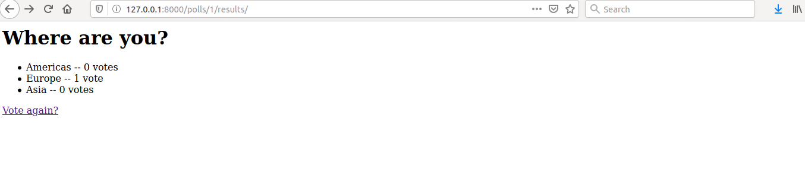
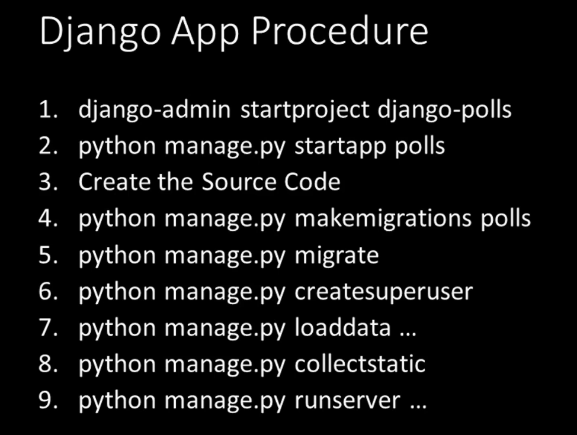

# Python app in docker container
```
$ cd simple-flask

$ sudo docker build -t johnderasia/simple-flask:v1.0 .

$ sudo docker run --rm -it -p 5001:5000 johnderasia/simple-flask:v1.0
```


# Shipping image to Docker Hub
```
$ sudo docker login --username=johnderasia

$ sudo docker push johnderasia/simple-flask:v1.0
```


# Running app on AWS
```
$ sudo docker-machine create --driver amazonec2 --amazonec2-open-port 5000 --amazonec2-region eu-west3 aws-machine

$ sudo docker-machine env aws-machine

$ bash

$ eval $(docker-machine env aws-machine)

$ docker-machine ip aws-machine

$ docker run --rm -it -p 5001:5000 johnderasia/simple-flask:v1.0
```

## delete the ec2
```
$ sudo docker-machine rm aws-machine
```

# Docker on Linux - Security Warning
- docker only runs with root privilege
> user in the docker group can add themselves to sudoers and also modify host
```
$ docker run -it --rm -v /:/host centos chroot /host
```

# Lauch python interpreter from docker
## pull python image
```
$ sudo docker image pull python
```
## create container
```
$ sudo docker container create --tty --interactive python
```
## list the created container
```
$ sudo docker container ps --all
CONTAINER ID        IMAGE                 COMMAND                  CREATED              STATUS                     PORTS               NAMES
6e760fc8e2a8        python                "python3"                About a minute ago   Created                                        practical_villani
```
## rename the container
```
$ sudo docker container rename practical_villani mypython

$ sudo docker container ps --all
CONTAINER ID        IMAGE                 COMMAND                  CREATED             STATUS                     PORTS               NAMES
6e760fc8e2a8        python                "python3"                3 minutes ago       Created                                        mypython
```
## use the container
```
$ sudo docker container start --interactive mypython
Python 3.8.3 (default, May 16 2020, 07:08:28) 
[GCC 8.3.0] on linux
Type "help", "copyright", "credits" or "license" for more information.
>>> 
```
## get hostname and exit with 99 code
```
$ sudo docker container start --interactive mypython
Python 3.8.3 (default, May 16 2020, 07:08:28) 
[GCC 8.3.0] on linux
Type "help", "copyright", "credits" or "license" for more information.
>>> import socket
>>> print(socket.gethostname())
6e760fc8e2a8
>>> 
>>> exit(99)

$ sudo docker container ps --all
CONTAINER ID        IMAGE                 COMMAND                  CREATED             STATUS                      PORTS               NAMES
6e760fc8e2a8        python                "python3"                7 minutes ago       Exited (99) 4 seconds ago                       mypython
```
## delete the container
```
$ sudo docker container rm mypython

$ sudo docker container ps --all
CONTAINER ID        IMAGE                 COMMAND                  CREATED             STATUS                     PORTS               NAMES
```
## delete the python image
```
$ sudo docker rmi python
```

# Command Abbreviations


## run container and download image if not in local storage
```
$ sudo docker run -it --name mypython python
```

# Intergrating Containers with Host System

```
$ git clone https://github.com/pythonincontainers/myfirst.git
$ cd myfirst
$ cat myfirst.py
print('Python in Containers! Version 1')
```


## modify myfirst.py
```
$ vim myfirst.py
$ cat myfirst.py
print('Python in Containers! Version 2000')
```
## Mount directory that has source code into container
```
$ sudo docker run -it --name mypython -v ${PWD}:/app python
Python 3.8.3 (default, May 16 2020, 07:08:28) 
[GCC 8.3.0] on linux
Type "help", "copyright", "credits" or "license" for more information.
>>> exec(open('/app/myfirst.py').read())
Python in Containers! Version 2000
>>>
```
## Run Command Argument

## modify myfirst.py again
```
$ vim myfirst.py

$ cat myfirst.py
print('Python in Containers! Version 2000.0')
```
## run docker container with argument
```
$ sudo docker run -it --name myfirst -v ${PWD}:/app python /app/myfirst.py
Python in Containers! Version 2000,0
```
## we can use start to see the output each time we modify myfirst.py
```
$ sudo docker start -i myfirst
Python in Containers! Version 3
```
## start second container
```
$ sudo docker run -it --name mysecond -v ${PWD}:/app python /app/mysecond.py
Python in Containers!
What is your name? kris
Greetings kris
```
## more interactive when started with plain shell promt
```
$ sudo docker run -it --name mypython -v ${PWD}:/app python /bin/bash
root@ffa2999f1926:/# cd /app
root@ffa2999f1926:/app# python mysecond.py 
Python in Containers!
What is your name? kris
Greetings kris
root@ffa2999f1926:/app#
```
# Bind port

## execute flask in container
```
$ sudo docker run -it --name mypython -v ${PWD}:/app -p 5001:5000 python /bin/bash
root@2922078afc21:/# cd /app
root@2922078afc21:/app# pip install flask
Collecting flask
  Downloading Flask-1.1.2-py2.py3-none-any.whl (94 kB)
     |████████████████████████████████| 94 kB 369 kB/s 
Collecting itsdangerous>=0.24
  Downloading itsdangerous-1.1.0-py2.py3-none-any.whl (16 kB)
Collecting Werkzeug>=0.15
  Downloading Werkzeug-1.0.1-py2.py3-none-any.whl (298 kB)
     |████████████████████████████████| 298 kB 3.4 MB/s 
Collecting click>=5.1
  Downloading click-7.1.2-py2.py3-none-any.whl (82 kB)
     |████████████████████████████████| 82 kB 189 kB/s 
Collecting Jinja2>=2.10.1
  Downloading Jinja2-2.11.2-py2.py3-none-any.whl (125 kB)
     |████████████████████████████████| 125 kB 3.3 MB/s 
Collecting MarkupSafe>=0.23
  Downloading MarkupSafe-1.1.1-cp38-cp38-manylinux1_x86_64.whl (32 kB)
Installing collected packages: itsdangerous, Werkzeug, click, MarkupSafe, Jinja2, flask
Successfully installed Jinja2-2.11.2 MarkupSafe-1.1.1 Werkzeug-1.0.1 click-7.1.2 flask-1.1.2 itsdangerous-1.1.0
root@2922078afc21:/app# 
root@2922078afc21:/app# export FLASK_DEBUG=1
root@2922078afc21:/app# export FLASK_APP=mythird.py
root@2922078afc21:/app# flask run --host=0.0.0.0
 * Serving Flask app "mythird.py" (lazy loading)
 * Environment: production
   WARNING: This is a development server. Do not use it in a production deployment.
   Use a production WSGI server instead.
 * Debug mode: on
 * Running on http://0.0.0.0:5000/ (Press CTRL+C to quit)
 * Restarting with stat
 * Debugger is active!
 * Debugger PIN: 105-860-997
```
## access 127.0.0.1:5001 from host browser

# Summary Intergrating Containers with Host System


# Container Images
## Image Start-up Command


```
$ sudo docker run pythonincontainers/entrypoint
one two three

$ sudo docker run pythonincontainers/entrypoint four five six
one four five six
```


```
$ sudo docker inspect --format "ENTRYPOINT={{.Config.Entrypoint}} CMD={{.Config.Cmd}}" pythonincontainers/entrypoint
ENTRYPOINT=[echo one] CMD=[two three]

$ sudo docker inspect --format "ENTRYPOINT={{.Config.Entrypoint}} CMD={{.Config.Cmd}}" python
ENTRYPOINT=[] CMD=[python3]

$ sudo docker inspect --format "ENTRYPOINT={{.Config.Entrypoint}} CMD={{.Config.Cmd}}" centos
ENTRYPOINT=[] CMD=[/bin/bash]

$ sudo docker pull nginx
$ sudo docker inspect --format "ENTRYPOINT={{.Config.Entrypoint}} CMD={{.Config.Cmd}}" nginx
ENTRYPOINT=[/docker-entrypoint.sh] CMD=[nginx -g daemon off;]

$ sudo docker pull postgres
$ sudo docker inspect --format "ENTRYPOINT={{.Config.Entrypoint}} CMD={{.Config.Cmd}}" postgres
ENTRYPOINT=[docker-entrypoint.sh] CMD=[postgres]
```

## overwrite entry point
```
$ sudo docker run --rm --entrypoint date centos
Wed Jun 10 16:43:52 UTC 2020
```

# Managing Containers

## interactive and non interactive

```
$ sudo docker run -d -p 5000:5000 --name simple-flask pythonincontainers/simple-flask
```

## interact with detached container
```
$ sudo docker logs simple-flask
 * Serving Flask app "hello" (lazy loading)
 * Environment: production
   WARNING: Do not use the development server in a production environment.
   Use a production WSGI server instead.
 * Debug mode: off
 * Running on http://0.0.0.0:5000/ (Press CTRL+C to quit)
```
## tail the logs
```
$ sudo docker logs -t -f simple-flask
2020-06-11T02:19:53.637968644Z  * Serving Flask app "hello" (lazy loading)
2020-06-11T02:19:53.638053236Z  * Environment: production
2020-06-11T02:19:53.638064418Z    WARNING: Do not use the development server in a production environment.
2020-06-11T02:19:53.638091376Z    Use a production WSGI server instead.
2020-06-11T02:19:53.638100957Z  * Debug mode: off
2020-06-11T02:19:53.781179927Z  * Running on http://0.0.0.0:5000/ (Press CTRL+C to quit)
2020-06-11T02:22:08.065403094Z 172.17.0.1 - - [11/Jun/2020 02:22:08] "GET / HTTP/1.1" 200 -
```
## run adhoc commands on running container
```
$ sudo docker ps -a
CONTAINER ID        IMAGE                             COMMAND                  CREATED             STATUS              PORTS                    NAMES
56a49f92bd7e        pythonincontainers/simple-flask   "/bin/sh -c 'python …"   4 minutes ago       Up 4 minutes        0.0.0.0:5000->5000/tcp   simple-flask

$ sudo docker exec simple-flask ps -ef
UID        PID  PPID  C STIME TTY          TIME CMD
root         1     0  0 02:19 ?        00:00:00 /bin/sh -c python hello.py
root         6     1  0 02:19 ?        00:00:00 python hello.py
root         8     0  2 02:24 ?        00:00:00 ps -ef

$ sudo docker exec -it simple-flask bash
root@56a49f92bd7e:/usr/src/app# 
```

## Limit Container Resources

### Limit memory
```
$ sudo docker run -it -m 100m --memory-swap 100m python bash
root@1981990bd882:/# pip install numpy
Collecting numpy
  Downloading numpy-1.18.5-cp38-cp38-manylinux1_x86_64.whl (20.6 MB)
     |████████████████████████████████| 20.6 MB 45 kB/s 
Installing collected packages: numpy
Successfully installed numpy-1.18.5
root@1981990bd882:/# python
Python 3.8.3 (default, Jun  9 2020, 17:39:39) 
[GCC 8.3.0] on linux
Type "help", "copyright", "credits" or "license" for more information.
>>> import numpy
>>> result = [numpy.random.bytes(1024*1024) for x in range(10240)]
Killed
root@1981990bd882:/#

$ sudo docker stats
CONTAINER ID        NAME                CPU %               MEM USAGE / LIMIT     MEM %               NET I/O             BLOCK I/O           PIDS
1981990bd882        pedantic_cray       24.00%              99.37MiB / 100MiB     99.37%              21.8MB / 487kB      300MB / 14.9GB      5
```
### Limit CPU
```
$ sudo docker run -it -m 100m --memory-swap 100m --cpus 0.1 python bash
```
## Remove containers
```
$ sudo docker ps -a
CONTAINER ID        IMAGE                             COMMAND                  CREATED             STATUS                       PORTS                    NAMES
6442ef2f8a2c        python                            "bash"                   6 minutes ago       Exited (130) 9 seconds ago                            tender_brattain
1981990bd882        python                            "bash"                   17 minutes ago      Exited (137) 7 minutes ago                            pedantic_cray
56a49f92bd7e        pythonincontainers/simple-flask   "/bin/sh -c 'python …"   29 minutes ago      Up 29 minutes                0.0.0.0:5000->5000/tcp   simple-flask

$ sudo docker rm -f $(sudo docker ps -a -q)
6442ef2f8a2c
1981990bd882
56a49f92bd7e
```

# Running Multiple Containers
> Needs proper networking
```
$ sudo docker run -d -p 5000:5000 --name simple-flask pythonincontainers/simple-flask
```
## Access flask app from host
```
$ curl 127.0.0.1:5000
Flask Hello world! Version 1
```

## Access flask app from another container
```
$ sudo docker run -it --name centos centos
[root@8d8a9f3243ac /]# curl 127.0.0.1:5000
curl: (7) Failed to connect to 127.0.0.1 port 5000: Connection refused
```

## get containers IP
```
$ sudo docker inspect --format "{{.NetworkSettings.IPAddress}}" simple-flask
172.17.0.2
$ sudo docker inspect --format "{{.NetworkSettings.IPAddress}}" centos
172.17.0.3
```

## Access flask app from another container using IP
```
$ sudo docker run -it --name centos centos
[root@71a732cba418 /]# curl 172.17.0.2:5000
Flask Hello world! Version 1
```

## Add simple-flask to /etc/hosts of container
```
$ sudo docker run --rm -it --name centos --add-host simple-flask:172.17.0.2 centos
[root@d11c21c5d670 /]# cat /etc/hosts
127.0.0.1	localhost
::1	localhost ip6-localhost ip6-loopback
fe00::0	ip6-localnet
ff00::0	ip6-mcastprefix
ff02::1	ip6-allnodes
ff02::2	ip6-allrouters
172.17.0.2	simple-flask
172.17.0.3	d11c21c5d670
[root@d11c21c5d670 /]# 
[root@d11c21c5d670 /]# curl simple-flask:5000 
Flask Hello world! Version 1
```


## Add vnet
> Use virtual network vnet to group all containers in one network and all the containers will be able to talk with each another using hostnames

## Create virtual network
```
$ sudo docker network create my-vnet
```

## Add containers to the virtual network and access flask
```
$ sudo docker run -d --name simple-flask --network my-vnet pythonincontainers/simple-flask

$ sudo docker run --rm -it --name centos --network my-vnet centos
[root@29ca1ef0e206 /]# curl simple-flask:5000
Flask Hello world! Version 1
```

## setup postgress database container and access it using pgadmin container


```
$ sudo docker run -d --name posgres --network my-vnet --env "POSTGRES_PASSWORD=mysecret" postgres

$ sudo docker logs --tail 1 posgres
2020-06-11 04:35:36.327 UTC [1] LOG:  database system is ready to accept connections

$ sudo docker run -d --name pgadmin --network my-vnet -e "PGADMIN_DEFAULT_EMAIL=user@example.com" -e "PGADMIN_DEFAULT_PASSWORD=supersecret" -p 8088:80 dpage/pgadmin4
```

## Access pgadmin from host


## set connection to postgres database


## create new database called mydatabase


## use sqlalchemy to update database
```
$ git clone https://github.com/pythonincontainers/sqlalchemy-psql.git

$ docker run --rm -it -v ${PWD}:/app --network my-vnet python bash
root@a78db869ffbc:/# cd /app/
root@a78db869ffbc:/app# pip install -r requirements.txt 
Collecting psycopg2
  Downloading psycopg2-2.8.5.tar.gz (380 kB)
     |████████████████████████████████| 380 kB 150 kB/s 
Collecting sqlalchemy
  Downloading SQLAlchemy-1.3.17-cp38-cp38-manylinux2010_x86_64.whl (1.3 MB)
     |████████████████████████████████| 1.3 MB 423 kB/s 
Building wheels for collected packages: psycopg2
  Building wheel for psycopg2 (setup.py) ... done
  Created wheel for psycopg2: filename=psycopg2-2.8.5-cp38-cp38-linux_x86_64.whl size=500518 sha256=6461212f046740f647308dadc8fa2c4fbb57552d4afdec81ada8199c787be9b7
  Stored in directory: /root/.cache/pip/wheels/35/64/21/9c9e2c1bb9cd6bca3c1b97b955615e37fd309f8e8b0b9fdf1a
Successfully built psycopg2
Installing collected packages: psycopg2, sqlalchemy
Successfully installed psycopg2-2.8.5 sqlalchemy-1.3.17
root@a78db869ffbc:/app# 
root@a78db869ffbc:/app# python alchemy-psql.py
```

## person table created and populated with data from alchemy-psql.py


# Container Networking
## View all networks
```
$ docker network ls
NETWORK ID          NAME                   DRIVER              SCOPE
f094375d36c6        bridge                 bridge              local
46d548312e32        frappedocker_default   bridge              local
67f31866166a        host                   host                local
0fcf8cac2e33        my-net                 bridge              local
978b606f5105        my-vnet                bridge              local
2275499b573c        none                   null                local
489fcda7f785        snakeeyes_default      bridge              local
```
## delete network
```
$ docker network rm my-net
my-net
```
## custom subnet
```
$ docker network create --subnet 10.10.0.0/16 my-addr

$ docker run --rm -it --name alpine1 --network my-addr alpine
/ # ifconfig 
eth0      Link encap:Ethernet  HWaddr 02:42:0A:0A:00:02  
          inet addr:10.10.0.2  Bcast:10.10.255.255  Mask:255.255.0.0
          UP BROADCAST RUNNING MULTICAST  MTU:1500  Metric:1
          RX packets:52 errors:0 dropped:0 overruns:0 frame:0
          TX packets:0 errors:0 dropped:0 overruns:0 carrier:0
          collisions:0 txqueuelen:0 
          RX bytes:6851 (6.6 KiB)  TX bytes:0 (0.0 B)

lo        Link encap:Local Loopback  
          inet addr:127.0.0.1  Mask:255.0.0.0
          UP LOOPBACK RUNNING  MTU:65536  Metric:1
          RX packets:0 errors:0 dropped:0 overruns:0 frame:0
          TX packets:0 errors:0 dropped:0 overruns:0 carrier:0
          collisions:0 txqueuelen:1000 
          RX bytes:0 (0.0 B)  TX bytes:0 (0.0 B)

/ # 
```
## start another container
```
$ docker run --rm -it --name alpine2 alpine
/ # ifconfig 
eth0      Link encap:Ethernet  HWaddr 02:42:AC:11:00:02  
          inet addr:172.17.0.2  Bcast:172.17.255.255  Mask:255.255.0.0
          UP BROADCAST RUNNING MULTICAST  MTU:1500  Metric:1
          RX packets:26 errors:0 dropped:0 overruns:0 frame:0
          TX packets:0 errors:0 dropped:0 overruns:0 carrier:0
          collisions:0 txqueuelen:0 
          RX bytes:3142 (3.0 KiB)  TX bytes:0 (0.0 B)

lo        Link encap:Local Loopback  
          inet addr:127.0.0.1  Mask:255.0.0.0
          UP LOOPBACK RUNNING  MTU:65536  Metric:1
          RX packets:0 errors:0 dropped:0 overruns:0 frame:0
          TX packets:0 errors:0 dropped:0 overruns:0 carrier:0
          collisions:0 txqueuelen:1000 
          RX bytes:0 (0.0 B)  TX bytes:0 (0.0 B)

 
```
## connect alpine2 to my-addr network
```
$ docker network connect my-addr alpine2
```
## ifconfig on alpine2 again
```
/ # ifconfig 
eth0      Link encap:Ethernet  HWaddr 02:42:AC:11:00:02  
          inet addr:172.17.0.2  Bcast:172.17.255.255  Mask:255.255.0.0
          UP BROADCAST RUNNING MULTICAST  MTU:1500  Metric:1
          RX packets:28 errors:0 dropped:0 overruns:0 frame:0
          TX packets:0 errors:0 dropped:0 overruns:0 carrier:0
          collisions:0 txqueuelen:0 
          RX bytes:3319 (3.2 KiB)  TX bytes:0 (0.0 B)

eth1      Link encap:Ethernet  HWaddr 02:42:0A:0A:00:03  
          inet addr:10.10.0.3  Bcast:10.10.255.255  Mask:255.255.0.0
          UP BROADCAST RUNNING MULTICAST  MTU:1500  Metric:1
          RX packets:14 errors:0 dropped:0 overruns:0 frame:0
          TX packets:0 errors:0 dropped:0 overruns:0 carrier:0
          collisions:0 txqueuelen:0 
          RX bytes:1798 (1.7 KiB)  TX bytes:0 (0.0 B)

lo        Link encap:Local Loopback  
          inet addr:127.0.0.1  Mask:255.0.0.0
          UP LOOPBACK RUNNING  MTU:65536  Metric:1
          RX packets:0 errors:0 dropped:0 overruns:0 frame:0
          TX packets:0 errors:0 dropped:0 overruns:0 carrier:0
          collisions:0 txqueuelen:1000 
          RX bytes:0 (0.0 B)  TX bytes:0 (0.0 B)

/ #
```

## create LAN only network
```
$ docker network create --internal int-net

$ docker run -dit --name int1 --network int-net alpine

$ docker run -dit --name int2 --network int-net alpine
```

# Data Persistency - Volumes
> docker container are stateless
> file will exist as long container exists

```
$ docker run -it --name mypython python bash
root@709220a34b5e:/# mkdir /app
root@709220a34b5e:/# cd /app
root@709220a34b5e:/app# touch hi.txt
root@709220a34b5e:/app# 
root@709220a34b5e:/app# exit

$ docker start -i mypython
root@709220a34b5e:/# ls -l /app/hi.txt 
-rw-r--r-- 1 root root 0 Jun 11 15:25 /app/hi.txt
root@709220a34b5e:/# exit

$ docker rm mypython

$ docker run -it --name mypython python bash
root@3d7cd75e7cbb:/# ls -l /app/hi.txt
ls: cannot access '/app/hi.txt': No such file or directory
```

## create volume
```
$ docker volume create my-vol
```
## volume location
```
$ docker volume inspect my-vol
[
    {
        "CreatedAt": "2020-06-11T23:33:08+08:00",
        "Driver": "local",
        "Labels": {},
        "Mountpoint": "/var/lib/docker/volumes/my-vol/_data",
        "Name": "my-vol",
        "Options": {},
        "Scope": "local"
    }
]
```

## create container with volume
```
$ docker run -it --name mypyhon --volume my-vol:/app python bash
root@7ff61074210a:/# 
root@7ff61074210a:/# cd /app
root@7ff61074210a:/app# touch hi.txt
root@7ff61074210a:/app# exit

$ docker rm mypyhon

$ docker run -it --name mypyhon --volume my-vol:/app python bash
root@39beaf9e14c0:/# ls -l /app/hi.txt 
-rw-r--r-- 1 root root 0 Jun 11 15:33 /app/hi.txt
```

## delete volume
```
$ docker volume rm my-vol
```

## Docker Bind Mount for local development

```
$ docker run --rm -it -v ${PWD}:/app python bash
root@59ae5351082e:/# touch /app/hello.txt
root@59ae5351082e:/# exit

$ ls -l hello.txt 
-rw-r--r-- 1 root root 0 Jun  11 23:41 hello.txt
```

# Dockerfile Introduction
```
$ git clone https://github.com/pythonincontainers/flask-hello.git

$ cd flask-hello

$ docker run --rm -it -p 5000:5000 -v ${PWD}:/app python bash
root@0a1fdfc71b14:/# cd /app/
root@0a1fdfc71b14:/app# pip install Flask
Collecting Flask
  Downloading Flask-1.1.2-py2.py3-none-any.whl (94 kB)
     |████████████████████████████████| 94 kB 329 kB/s 
Collecting Jinja2>=2.10.1
  Downloading Jinja2-2.11.2-py2.py3-none-any.whl (125 kB)
     |████████████████████████████████| 125 kB 1.8 MB/s 
Collecting click>=5.1
  Downloading click-7.1.2-py2.py3-none-any.whl (82 kB)
     |████████████████████████████████| 82 kB 129 kB/s 
Collecting Werkzeug>=0.15
  Downloading Werkzeug-1.0.1-py2.py3-none-any.whl (298 kB)
     |████████████████████████████████| 298 kB 700 kB/s 
Collecting itsdangerous>=0.24
  Downloading itsdangerous-1.1.0-py2.py3-none-any.whl (16 kB)
Collecting MarkupSafe>=0.23
  Downloading MarkupSafe-1.1.1-cp38-cp38-manylinux1_x86_64.whl (32 kB)
Installing collected packages: MarkupSafe, Jinja2, click, Werkzeug, itsdangerous, Flask
Successfully installed Flask-1.1.2 Jinja2-2.11.2 MarkupSafe-1.1.1 Werkzeug-1.0.1 click-7.1.2 itsdangerous-1.1.0
root@0a1fdfc71b14:/app# export FLASK_DEBUG=True
root@0a1fdfc71b14:/app# python flask-hello.py 
 * Serving Flask app "flask-hello" (lazy loading)
 * Environment: production
   WARNING: This is a development server. Do not use it in a production deployment.
   Use a production WSGI server instead.
 * Debug mode: off
 * Running on http://0.0.0.0:5000/ (Press CTRL+C to quit)
```

> Problem too many to steps to start flask

## Solution use docker build instead

```
$ cat Dockerfile
FROM python
WORKDIR /myproject
COPY . .
RUN pip install -r requirements.txt
EXPOSE 5000
ENV FLASK_DEBUG=True
CMD python flask-hello.py
```
## Build the image in the current directory with name flask-hello:1.0
```
$ docker build -t flask-hello:1.0 .
```
## Execute the created image
> -P will automatically expose default ports
```
$ docker run -d -P --name flask-hello flask-hello:1.0
68cfbe68fa5f5ab12ab7c46fdcad25ff33fabf315621d8c90730fcce8ae9a1dd

$ docker ps
CONTAINER ID        IMAGE               COMMAND                  CREATED              STATUS              PORTS                     NAMES
68cfbe68fa5f        flask-hello:1.0     "/bin/sh -c 'python …"   About a minute ago   Up About a minute   0.0.0.0:32768->5000/tcp   flask-hello

$ curl 0.0.0.0:32768
Flask Hello world! Version 3
```

## build image algorithm


# Build Container Images


# Manual Image Build Process

```
$ mkdir manual-build

$ cd manual-build

$ vim hello.py
```
```py
# hello.py
from flask import Flask

app = Flask(__name__)


@app.route('/')
def hello():
    return 'Hello, World!'
```
## create script for the following commands

```
$ vim start-app.sh
cd /app
export FLASK_APP='hello'
export FLASK_ENV='development'
export FLASK_RUN_HOST='0.0.0.0'
flask run

$ docker create -it --name manual -p 5000:5000 python /bin/sh
186d22242bba8cd1731b349ed5dfaced77d72061c4f024e79be1fa43c36b05f3

$ docker start -i manual
# mkdir /app
# exit

$ docker cp hello.py manual:/app

$ docker cp start-app.sh manual:/app

$ docker start -i manual
# cd /app
# ls
hello.py  start-app.sh
# chmod +x start-app.sh	
# pip install Flask
Collecting Flask
  Downloading Flask-1.1.2-py2.py3-none-any.whl (94 kB)
     |████████████████████████████████| 94 kB 376 kB/s 
Collecting Werkzeug>=0.15
  Downloading Werkzeug-1.0.1-py2.py3-none-any.whl (298 kB)
     |████████████████████████████████| 298 kB 3.3 MB/s 
Collecting click>=5.1
  Downloading click-7.1.2-py2.py3-none-any.whl (82 kB)
     |████████████████████████████████| 82 kB 150 kB/s 
Collecting Jinja2>=2.10.1
  Downloading Jinja2-2.11.2-py2.py3-none-any.whl (125 kB)
     |████████████████████████████████| 125 kB 1.1 MB/s 
Collecting itsdangerous>=0.24
  Downloading itsdangerous-1.1.0-py2.py3-none-any.whl (16 kB)
Collecting MarkupSafe>=0.23
  Downloading MarkupSafe-1.1.1-cp38-cp38-manylinux1_x86_64.whl (32 kB)
Installing collected packages: Werkzeug, click, MarkupSafe, Jinja2, itsdangerous, Flask
Successfully installed Flask-1.1.2 Jinja2-2.11.2 MarkupSafe-1.1.1 Werkzeug-1.0.1 click-7.1.2 itsdangerous-1.1.0
# /app/start-app.sh
 * Serving Flask app "hello" (lazy loading)
 * Environment: development
 * Debug mode: on
 * Running on http://0.0.0.0:5000/ (Press CTRL+C to quit)
 * Restarting with stat
 * Debugger is active!
 * Debugger PIN: 124-729-936
```

```
$ curl 127.0.0.1:5000
Hello, World!
```

## create the image
```
$ docker commit --change "CMD /app/start-app.sh" manual manual-image:1.1
sha256:acc8438ea7edd92ce31ad883f4c67bf15256487bd2bbf8663e43c30b524ccdd9
```

## start the container
```
$ docker run -it --rm -p 5001:5000 manual-image:1.1
 * Serving Flask app "hello" (lazy loading)
 * Environment: development
 * Debug mode: on
 * Running on http://0.0.0.0:5000/ (Press CTRL+C to quit)
 * Restarting with stat
 * Debugger is active!
 * Debugger PIN: 326-685-887
```

## access the flask app
```
$ curl 127.0.0.1:5001
Hello, World!
```

# Dockerfile - Automation of Image Build


## create dockerfile
```
$ vim Dockerfile
# Base image
FROM python

# create the directory if doesn't exist and cd into it
WORKDIR /app

# copy hello.py and start-app.sh into app
COPY hello.py .
COPY start-app.sh .

# install flask
RUN pip install Flask

# startup command
CMD ["/bin/bash", "start-app.sh"]
```
## build the image
```
$ docker build -t automated-image:1.0 .
```
## start the container
```
$ docker run -it --rm -p 5000:5000 automated-image:1.0
 * Serving Flask app "hello" (lazy loading)
 * Environment: development
 * Debug mode: on
 * Running on http://0.0.0.0:5000/ (Press CTRL+C to quit)
 * Restarting with stat
 * Debugger is active!
 * Debugger PIN: 291-337-079
```
## access the flask app
```
$ curl 127.0.0.1:5000
Hello, World!
```

## use ENV to drop start-app.sh
```
$ vim Dockerfile.env
# Base image
FROM python

# create the directory if doesn't exist and cd into it
WORKDIR /app

# copy hello.py into app
COPY hello.py .

# install flask
RUN pip install Flask

# environment variables
ENV FLASK_APP "hello"
ENV FLASK_ENV "development"
ENV FLASK_RUN_HOST "0.0.0.0"

# startup command
CMD ["flask", "run"]
```

## build the image
```
$ docker build -f Dockerfile.env -t automated-image:1.1 .
```

## start the container
```
$ docker run -it --rm -p 5000:5000 automated-image:1.1
 * Serving Flask app "hello" (lazy loading)
 * Environment: development
 * Debug mode: on
 * Running on http://0.0.0.0:5000/ (Press CTRL+C to quit)
 * Restarting with stat
 * Debugger is active!
 * Debugger PIN: 109-373-717
```

## access the flask app
```
$ curl 127.0.0.1:5000
Hello, World!
```

## General flow


# Dockerfile Commands


# FROM commands


# WORKDIR commands


# COPY Commands


# Exclude with .dockerignore
> !include


## Exclude all except mysite and mysite_nginx.conf


# Docker build from github with Dockerfile in it

```
$ docker build -t flask-hello https://github.com/pythonincontainers/flask-hello.git
```

# RUN commands
> only runs with non interactive command


## Change shell


## Common use of RUN commands


# ENV commands


## overwrite ENV value


# VOLUME commands


```
$ mkdir dockerfile-vol

$ cd dockerfile-vol

$ vim Dockerfile.vol
FROM python
VOLUME /data
COPY hello.py /data/

$ vim hello.py
print('hello')

$ docker build -t vol -f Dockerfile.vol .

$ docker inspect -f "{{json .Config.Volumes}}" vol
{"/data":{}}

$ docker volume create data
data

$ docker run -it --name vol -v data:/data vol bash
root@595a8ca807a3:/# cd /data
root@595a8ca807a3:/data# ls 
hello.py
```

# EXPOSE command


# Start-up command CMD and ENTRYPOINT

```
$ mkdir dockerfile-cmd

$ cd dockerfile-cmd

$ vim Dockerfile.simple
FROM python
ENTRYPOINT ["python"]
CMD ["--version"]

$ docker build -t simple -f Dockerfile.simple .

$ docker run --rm simple
Python 3.8.3
```
## modify Dockerfile.simple
```
$ vim Dockerfile.simple
FROM python
ENTRYPOINT ["python"]
CMD ["-c", "print('Hello world')"]

$ docker build -t simple -f Dockerfile.simple .

$ docker run --rm simple
Hello world
```

## Example
```
$ git clone https://github.com/pythonincontainers/entrypoint-cmd

$ cd entrypoint-cmd

$ vim simple_args.py
```
```py
# simple_args.py
import sys

print(sys.argv)
```

```
$ vim Dockerfile.simple_entry
FROM python
WORKDIR /app/
COPY simple_args.py /app/
ENTRYPOINT ["python"]
CMD ["simple_args.py"]

$ docker build -t simple_entry -f Dockerfile.simple_entry .

$ docker run --rm simple_entry
['simple_args.py']
```

## modify CMD, add more arguments
```
$ vim Dockerfile.simple_entry
FROM python
WORKDIR /app/
COPY simple_args.py /app/
ENTRYPOINT ["python"]
CMD ["simple_args.py", "one", "two"]

$ docker build -t simple_entry -f Dockerfile.simple_entry .

$ docker run --rm simple_entry
['simple_args.py', 'one', 'two']
```

## remove CMD completely
```
$ vim Dockerfile.simple_entry
FROM python
WORKDIR /app/
COPY simple_args.py /app/
ENTRYPOINT ["python", "simple_args.py", "one", "two"]

$ docker build -t simple_entry -f Dockerfile.simple_entry .

$ docker run --rm simple_entry
['simple_args.py', 'one', 'two']
```

## remove ENTRYPOINT and put everythin in CMD
```
$ vim Dockerfile.simple_entry
FROM python
WORKDIR /app/
COPY simple_args.py /app/
CMD ["python", "simple_args.py", "one", "two"]

$ docker build -t simple_entry -f Dockerfile.simple_entry .

$ docker run --rm simple_entry
['simple_args.py', 'one', 'two']
```

## Run with diffrent entrypoint or overwrite it
```
$ docker run --rm --entrypoint python3 simple_entry simple_args.py five six seven
['simple_args.py', 'five', 'six', 'seven']
```

## start with /bin/sh
```
$ docker run -it --rm --entrypoint="" simple_entry /bin/sh
# 
```


```
$ vim Dockerfile.shell
FROM python
WORKDIR /app/
COPY simple_args.py /app/
CMD python simple_args.py one two
```
## build the image and inspect
```
$ docker build -t shell -f Dockerfile.shell .

$ docker inspect -f "ENTRYPOINT={{.Config.Entrypoint}} CMD={{.Config.Cmd}}" shell
ENTRYPOINT=[] CMD=[/bin/sh -c python simple_args.py one two]
```

# ARG command
> parametrizing docker files to change versions easily insted of modifying dockerfiles

> if NO --arg file the default values will be used

```
$ git clone https://github.com/pythonincontainers/dockerfile-arg

$ cd dockerfile-arg

$ cat Dockerfile.arg 
ARG Python_Image_Name=python
ARG Python_Image_Tag=latest
FROM $Python_Image_Name:$Python_Image_Tag
ARG Flask_Ver=1.0.2
RUN pip install flask==$Flask_Ver
WORKDIR /app
COPY hello-v2.py .
CMD ["python","hello-v2.py"]
```

## change flask version to 1.0.0
```
$ docker build -t args -f Dockerfile.arg --build-arg Flask_Ver=1.0.0 .
```

## change flask version to 1.0.0 and python image to slim
```
$ docker build -t args -f Dockerfile.arg --build-arg Flask_Ver=1.0.0 --build-arg Python_Image_Tag=slim .
```
## Assign ARG variable to ENV variable to stored in metadata
```
$ cat Dockerfile.env 
ARG Python_Image_Name=python
ARG Python_Image_Tag=latest
FROM $Python_Image_Name:$Python_Image_Tag
ARG Flask_Ver=1.0.2
ARG Python_Image_Name=python
ARG Python_Image_Tag=latest
ENV PYTHON_IMAGE_NAME $Python_Image_Name
ENV PYTHON_IMAGE_TAG $Python_Image_Tag
ENV FLASK_VER $Flask_Ver
RUN pip install flask==$Flask_Ver
WORKDIR /app
COPY hello-v2.py .
CMD ["python","hello-v2.py"]

$ docker build -t args -f Dockerfile.env --build-arg Python_Image_Name=centos/python-36-centos7 .
```


# Build time versus Run Time Execution

```
$ git clone https://github.com/pythonincontainers/buildtime-runtime

$ cd buildtime-runtime

$ grep -A5 DATABASES  mysite/settings.py
DATABASES = {
    'default': {
        'ENGINE': 'django.db.backends.sqlite3',
        'NAME': '/data/db.sqlite3',
    }
}
```
# Initialzation Strategy

## 1. Runtime Initialization
- buildtime to prepare the filesystem, install app and libraries
- migration and admin creation is created after the container is started

```
$ cat Dockerfile.runtime
FROM python:3.7.3
WORKDIR /django-mysite
COPY . .
CMD ["/bin/bash", "run-server.sh"]

$ cat run-server.sh 
#! /bin/bash

# Install Python Libraries from requirements.txt
pip install -r requirements.txt

# Create /data directory to store sqlite3 data files
mkdir -p /data

# Initialize Database
python manage.py migrate

# Create 'admin' User
/bin/bash create-admin.sh

python manage.py runserver 0.0.0.0:8000
```

## build the image
```
$ docker build -t runtime -f Dockerfile.runtime .
```

## start the container
> Django version 2.2.1 is installed

```
$ docker run -it --rm -p 8000:8000 runtime
Collecting Django==2.2.1 (from -r requirements.txt (line 1))
  Downloading https://files.pythonhosted.org/packages/b1/1d/2476110614367adfb079a9bc718621f9fc8351e9214e1750cae1832d4090/Django-2.2.1-py3-none-any.whl (7.4MB)
     |████████████████████████████████| 7.5MB 3.3MB/s 
Collecting sqlparse (from Django==2.2.1->-r requirements.txt (line 1))
  Downloading https://files.pythonhosted.org/packages/85/ee/6e821932f413a5c4b76be9c5936e313e4fc626b33f16e027866e1d60f588/sqlparse-0.3.1-py2.py3-none-any.whl (40kB)
     |████████████████████████████████| 40kB 5.2MB/s 
Collecting pytz (from Django==2.2.1->-r requirements.txt (line 1))
  Downloading https://files.pythonhosted.org/packages/4f/a4/879454d49688e2fad93e59d7d4efda580b783c745fd2ec2a3adf87b0808d/pytz-2020.1-py2.py3-none-any.whl (510kB)
     |████████████████████████████████| 512kB 3.8MB/s 
Installing collected packages: sqlparse, pytz, Django
Successfully installed Django-2.2.1 pytz-2020.1 sqlparse-0.3.1
WARNING: You are using pip version 19.1.1, however version 20.1.1 is available.
You should consider upgrading via the 'pip install --upgrade pip' command.
Operations to perform:
  Apply all migrations: admin, auth, contenttypes, polls, sessions
Running migrations:
  Applying contenttypes.0001_initial... OK
  Applying auth.0001_initial... OK
  Applying admin.0001_initial... OK
  Applying admin.0002_logentry_remove_auto_add... OK
  Applying admin.0003_logentry_add_action_flag_choices... OK
  Applying contenttypes.0002_remove_content_type_name... OK
  Applying auth.0002_alter_permission_name_max_length... OK
  Applying auth.0003_alter_user_email_max_length... OK
  Applying auth.0004_alter_user_username_opts... OK
  Applying auth.0005_alter_user_last_login_null... OK
  Applying auth.0006_require_contenttypes_0002... OK
  Applying auth.0007_alter_validators_add_error_messages... OK
  Applying auth.0008_alter_user_username_max_length... OK
  Applying auth.0009_alter_user_last_name_max_length... OK
  Applying auth.0010_alter_group_name_max_length... OK
  Applying auth.0011_update_proxy_permissions... OK
  Applying polls.0001_initial... OK
  Applying sessions.0001_initial... OK
Watching for file changes with StatReloader
Performing system checks...

System check identified no issues (0 silenced).
June 20, 2020 - 06:09:46
Django version 2.2.1, using settings 'mysite.settings'
Starting development server at http://0.0.0.0:8000/
Quit the server with CONTROL-C.
```


## if the container is restarted, django will be installed again and the created polls question will be absent


## set django version as a variable
```
$ vim Dockerfile.runtime
FROM python:3.7.3
WORKDIR /django-mysite
COPY . .
CMD ["/bin/bash", "run-server.sh"]
ENV DJANGO_VER 2.2.1

$ vim requirements.txt 
# Django==2.2.1
Django==${DJANGO_VER}

$ docker build -t runtime -f Dockerfile.runtime .

$ docker run -it --rm -p 8000:8000 runtime
Collecting Django==2.2.1 (from -r requirements.txt (line 2))
  Downloading https://files.pythonhosted.org/packages/b1/1d/2476110614367adfb079a9bc718621f9fc8351e9214e1750cae1832d4090/Django-2.2.1-py3-none-any.whl (7.4MB)
     |████████████████████████████████| 7.5MB 3.7MB/s 
```

## change django version using the --env argument
```
$ docker run -it --rm -p 8000:8000 -e DJANGO_V=2.1.8 runtime
Collecting Django==2.1.8 (from -r requirements.txt (line 2))
  Downloading https://files.pythonhosted.org/packages/a9/e4/fb8f473fe8ee659859cb712e25222243bbd55ece7c319301eeb60ccddc46/Django-2.1.8-py3-none-any.whl (7.3MB)
     |████████████████████████████████| 7.3MB 3.1MB/s 
```

## 2. Buildtime Initialization

```
$ cat Dockerfile.buildtime 
FROM python:3.7.3
WORKDIR /django-mysite
COPY . .
ARG DJANGO_VER=2.2.1
RUN pip install -r requirements.txt
RUN mkdir -p /data && python manage.py migrate
RUN bash create-admin.sh
VOLUME /data
CMD ["python", "manage.py", "runserver", "0.0.0.0:8000"]

$ docker build -t buildtime -f Dockerfile.buildtime .

$ docker volume create buildtime-vol
buildtime-vol

$ docker run -it --rm -v buildtime-vol:/data -p 8000:8000 buildtime
Watching for file changes with StatReloader
Performing system checks...

System check identified no issues (0 silenced).
June 20, 2020 - 08:00:04
Django version 2.2.1, using settings 'mysite.settings'
Starting development server at http://0.0.0.0:8000/
Quit the server with CONTROL-C.

```




## restart the container and the polls question will be remain there
```
$ docker run -it --rm -v buildtime-vol:/data -p 8000:8000 buildtime
Watching for file changes with StatReloader
Performing system checks...

System check identified no issues (0 silenced).
June 20, 2020 - 09:37:33
Django version 2.2.1, using settings 'mysite.settings'
Starting development server at http://0.0.0.0:8000/
Quit the server with CONTROL-C.
```


# run image without building it using git
```
$ docker run -it --rm -p 8000:8000 python:3.7.3 bash -c "git clone https://github.com/pythonincontainers/buildtime-runtime /django-mysite; cd django-mysite; bash run-server.sh"
Cloning into '/django-mysite'...
remote: Enumerating objects: 14, done.
remote: Counting objects: 100% (14/14), done.
remote: Compressing objects: 100% (3/3), done.
remote: Total 70 (delta 11), reused 10 (delta 10), pack-reused 56
Unpacking objects: 100% (70/70), done.
Collecting Django==2.2.1 (from -r requirements.txt (line 1))
  Downloading https://files.pythonhosted.org/packages/b1/1d/2476110614367adfb079a9bc718621f9fc8351e9214e1750cae1832d4090/Django-2.2.1-py3-none-any.whl (7.4MB)
     |████████████████████████████████| 7.5MB 6.8MB/s 
Collecting pytz (from Django==2.2.1->-r requirements.txt (line 1))
  Downloading https://files.pythonhosted.org/packages/4f/a4/879454d49688e2fad93e59d7d4efda580b783c745fd2ec2a3adf87b0808d/pytz-2020.1-py2.py3-none-any.whl (510kB)
     |████████████████████████████████| 512kB 6.9MB/s 
Collecting sqlparse (from Django==2.2.1->-r requirements.txt (line 1))
  Downloading https://files.pythonhosted.org/packages/85/ee/6e821932f413a5c4b76be9c5936e313e4fc626b33f16e027866e1d60f588/sqlparse-0.3.1-py2.py3-none-any.whl (40kB)
     |████████████████████████████████| 40kB 6.8MB/s 
Installing collected packages: pytz, sqlparse, Django
Successfully installed Django-2.2.1 pytz-2020.1 sqlparse-0.3.1
WARNING: You are using pip version 19.1.1, however version 20.1.1 is available.
You should consider upgrading via the 'pip install --upgrade pip' command.
Operations to perform:
  Apply all migrations: admin, auth, contenttypes, polls, sessions
Running migrations:
  Applying contenttypes.0001_initial... OK
  Applying auth.0001_initial... OK
  Applying admin.0001_initial... OK
  Applying admin.0002_logentry_remove_auto_add... OK
  Applying admin.0003_logentry_add_action_flag_choices... OK
  Applying contenttypes.0002_remove_content_type_name... OK
  Applying auth.0002_alter_permission_name_max_length... OK
  Applying auth.0003_alter_user_email_max_length... OK
  Applying auth.0004_alter_user_username_opts... OK
  Applying auth.0005_alter_user_last_login_null... OK
  Applying auth.0006_require_contenttypes_0002... OK
  Applying auth.0007_alter_validators_add_error_messages... OK
  Applying auth.0008_alter_user_username_max_length... OK
  Applying auth.0009_alter_user_last_name_max_length... OK
  Applying auth.0010_alter_group_name_max_length... OK
  Applying auth.0011_update_proxy_permissions... OK
  Applying polls.0001_initial... OK
  Applying sessions.0001_initial... OK
Watching for file changes with StatReloader
Performing system checks...

System check identified no issues (0 silenced).
June 20, 2020 - 09:45:43
Django version 2.2.1, using settings 'mysite.settings'
Starting development server at http://0.0.0.0:8000/
Quit the server with CONTROL-C.
```

# Use cython to improve calculations
- cython will translate python code to c language
- flask app will calculate factors and the time it took
```
$ git clone https://github.com/pythonincontainers/multistage

$ cd multistage

$ cat factors.py
from typing import List

def find_factors(param: int) -> List[int]:
    result = [1]
    if param > 1:
        for i in range(2, param+1):
            if param % i == 0:
                result += [i]
    return result

$ cat compile.py
from distutils.core import setup
from distutils.extension import Extension
from Cython.Distutils import build_ext

ext_modules = [
    Extension("factors",
    ["factors.py"],
    libraries=["m"],
    extra_compile_args=["-ffast-math"]
    ),
]

setup(
    name = 'My factors lib',
    cmdclass = {'build_ext': build_ext},
    ext_modules = ext_modules
)

$ cat Dockerfile.cython-standard 
FROM python:3.7.3
WORKDIR /app
COPY . .
RUN pip install cython==0.28.5
RUN python compile.py build_ext --inplace
RUN pip install -r requirements.txt
CMD ["python","factors_flask.py"]
```
## build the image
```
$ docker build -t factors_flask:cython-standard -f Dockerfile.cython-standard .
```
## view the created c files
```
$ docker run -it --rm factors_flask:cython-standard bash
root@48c6d90a386e:/app# ls -l
total 308
drwxr-xr-x 3 root root   4096 Jun 20 10:18 build
-rw-rw-r-- 1 root root    355 Jun 20 10:10 compile.py
-rw-r--r-- 1 root root 150435 Jun 20 10:18 factors.c
-rwxr-xr-x 1 root root 135360 Jun 20 10:18 factors.cpython-37m-x86_64-linux-gnu.so
-rw-rw-r-- 1 root root    888 Jun 20 10:10 factors.py
-rw-rw-r-- 1 root root   1007 Jun 20 10:10 factors.pyx
-rw-rw-r-- 1 root root   2870 Jun 20 10:10 factors_flask.py
-rw-rw-r-- 1 root root     28 Jun 20 10:10 requirements.txt
```
## start the flask app
```
$ docker run -it --rm -p 5000:5000 factors_flask:cython-standard
 * Serving Flask app "factors_flask" (lazy loading)
 * Environment: production
   WARNING: This is a development server. Do not use it in a production deployment.
   Use a production WSGI server instead.
 * Debug mode: off
 * Running on http://0.0.0.0:5000/ (Press CTRL+C to quit)
```
## access the page


## compile with factors.pyx file
```
$ cat factors.pyx
from typing import List
cimport cython

@cython.boundscheck(False)
@cython.wraparound(False)
@cython.nonecheck(False)
@cython.cdivision(True)

def find_factors(int param):
    result = [1]
    cdef int i
    if param > 1:
        for i in range(2, param+1):
            if param % i == 0:
                result += [i]
    return result

$ cat compile.py
from distutils.core import setup
from distutils.extension import Extension
from Cython.Distutils import build_ext

ext_modules = [
    Extension("factors",
    ["factors.pyx"],
    libraries=["m"],
    extra_compile_args=["-ffast-math"]
    ),
]

setup(
    name = 'My factors lib',
    cmdclass = {'build_ext': build_ext},
    ext_modules = ext_modules
)
```
## build the image with optimized factors.pyx
```
$ docker build -t factors_flask:cython-optimized -f Dockerfile.cython-standard .
```
## start the flask app
```
$ docker run -it --rm -p 5000:5000 factors_flask:cython-optimized
 * Serving Flask app "factors_flask" (lazy loading)
 * Environment: production
   WARNING: This is a development server. Do not use it in a production deployment.
   Use a production WSGI server instead.
 * Debug mode: off
 * Running on http://0.0.0.0:5000/ (Press CTRL+C to quit)
```
## access the page


> SPEED increased 10x

# Multistage build
## view the image size
```
$ docker images factors_flask
REPOSITORY          TAG                 IMAGE ID            CREATED             SIZE
factors_flask       cython-optimized    234666195281        5 minutes ago       957MB
factors_flask       cython-standard     f96e06ebdb1f        14 minutes ago      957MB
```
## reduce cython image size


```
$ cat Dockerfile.cython-multi 
FROM python:3.7.3 as dev
WORKDIR /app
COPY . .
RUN pip install cython==0.28.5
RUN python compile.py build_ext --inplace

FROM python:3.7.3-slim as prod
WORKDIR /app
COPY factors_flask.py requirements.txt /app/
COPY --from=dev /app/factors.cpython-37m-x86_64-linux-gnu.so /app
RUN pip install -r requirements.txt
CMD ["python","factors_flask.py"]
```
## build the multi stage image
```
$ docker build -t factors_flask:cython-multi -f Dockerfile.cython-multi .
```
## start the flask app
```
$ docker run -it --rm -p 5000:5000 factors_flask:cython-multi
 * Serving Flask app "factors_flask" (lazy loading)
 * Environment: production
   WARNING: This is a development server. Do not use it in a production deployment.
   Use a production WSGI server instead.
 * Debug mode: off
 * Running on http://0.0.0.0:5000/ (Press CTRL+C to quit)
```
## access the page


## view the image size
```
$ docker images factors_flask
REPOSITORY          TAG                 IMAGE ID            CREATED             SIZE
factors_flask       cython-multi        ab39becc59b8        2 minutes ago       154MB
factors_flask       cython-optimized    234666195281        19 minutes ago      957MB
factors_flask       cython-standard     f96e06ebdb1f        29 minutes ago      957MB
```

# Dockerizing pytest


```
$ git clone https://github.com/pythonincontainers/simpletests

$ cd simpletests

$ cat Dockerfile.tester 
ARG BaseImage
FROM $BaseImage
ENV REPORTS_FOLDER=./test_reports
VOLUME /data
COPY tests/. .
CMD ["/bin/sh","/app/tester.sh"]
```

## build the image
```
$ docker build -t factors_flask:tester -f Dockerfile.tester --build-arg BaseImage=factors_flask:cython-multi .
```
## run the tests
```
$ docker run -it --rm -v ${PWD}:/data factors_flask:tester
-------------------------------------------------------------------

Running pylint

-------------------------------------------------------------------

Running pytest

===================================================== test session starts =====================================================
platform linux -- Python 3.7.3, pytest-4.5.0, py-1.8.2, pluggy-0.13.1 -- /usr/local/bin/python
cachedir: .pytest_cache
metadata: {'Python': '3.7.3', 'Platform': 'Linux-4.15.0-101-generic-x86_64-with-debian-9.9', 'Packages': {'pytest': '4.5.0', 'py': '1.8.2', 'pluggy': '0.13.1'}, 'Plugins': {'metadata': '1.9.0', 'html': '1.20.0', 'cov': '2.7.1'}}
rootdir: /app
plugins: metadata-1.9.0, html-1.20.0, cov-2.7.1
collected 4 items                                                                                                             

test_factors_flask.py::TestRoot::test_root_page PASSED                                                                  [ 25%]
test_factors_flask.py::TestUnsupportedPaths::test_unsupported_paths PASSED                                              [ 50%]
test_factors_flask.py::TestFactorsof6::test_factor_page_6 PASSED                                                        [ 75%]
test_factors_flask.py::TestFactorsof0::test_factor_page_0 PASSED                                                        [100%]

--------------------------------- generated html file: /data/test_reports/pytest_report.html ----------------------------------

----------- coverage: platform linux, python 3.7.3-final-0 -----------
Coverage annotated source written next to source
Coverage HTML written to dir htmlcov

================================================== 4 passed in 0.74 seconds ==================================================

$ ls -1 test_reports/*html
test_reports/pylint.html
test_reports/pytest_report.html
```

## generated html files


# Django Containerization for Development
- develop django using ide in local machine
- use container to start django app
- bind mount to local machine source code directory

```
$ git clone https://github.com/pythonincontainers/djangoimage

$ cd djangoimage

$ cat base_image/Dockerfile.mydjango 
# ARG to parameterize the base image, if values are not set during build time the default values will be used
ARG BaseImage=python
ARG ImageTag=3.7.3
FROM $BaseImage:$ImageTag
# PYTHONUNBUFFERED 1 tells python to print to standard output immediately without buffering
ENV PYTHONUNBUFFERED 1
ARG DjangoVersion=2.2.1
RUN pip install Django==$DjangoVersion
WORKDIR /code
```
## build the image using default values
```
$ cd base_image

$ docker build -t mydjango:2.2-3.7.3 -f Dockerfile.mydjango .
```
## check installed django version
```
$ docker inspect --format "ENTRYPOINT={{.Config.Entrypoint}} CMD={{.Config.Cmd}}" mydjango:2.2-3.7.3
ENTRYPOINT=[] CMD=[python3]

$ docker run -it --rm mydjango:2.2-3.7.3 django-admin --version
2.2.1
```
## add shortname to the image
```
$ docker tag mydjango:2.2-3.7.3 django
```
## create django project name myproject
```
$ docker run -it --rm -v ${PWD}:/code django django-admin startproject myproject

$ ls myproject/
manage.py  myproject
```

## initialize an app within the container using bash
```
$ docker run -it --rm -v ${PWD}:/code -p 8000:8000 django bash
root@c903e07f78ff:/code# cd myproject/
root@c903e07f78ff:/code/myproject# python manage.py startapp myapp
```

## initialize database
```
$ cd myproject/

$ docker run -it --rm -v ${PWD}:/code -p 8000:8000 django python manage.py migrate
Operations to perform:
  Apply all migrations: admin, auth, contenttypes, sessions
Running migrations:
  Applying contenttypes.0001_initial... OK
  Applying auth.0001_initial... OK
  Applying admin.0001_initial... OK
  Applying admin.0002_logentry_remove_auto_add... OK
  Applying admin.0003_logentry_add_action_flag_choices... OK
  Applying contenttypes.0002_remove_content_type_name... OK
  Applying auth.0002_alter_permission_name_max_length... OK
  Applying auth.0003_alter_user_email_max_length... OK
  Applying auth.0004_alter_user_username_opts... OK
  Applying auth.0005_alter_user_last_login_null... OK
  Applying auth.0006_require_contenttypes_0002... OK
  Applying auth.0007_alter_validators_add_error_messages... OK
  Applying auth.0008_alter_user_username_max_length... OK
  Applying auth.0009_alter_user_last_name_max_length... OK
  Applying auth.0010_alter_group_name_max_length... OK
  Applying auth.0011_update_proxy_permissions... OK
  Applying sessions.0001_initial... OK
```

## start developmet dev server
```
$ docker run -it --rm -v ${PWD}:/code -p 8000:8000 django python manage.py runserver 0.0.0.0:8000
Watching for file changes with StatReloader
Performing system checks...

System check identified no issues (0 silenced).
June 20, 2020 - 17:18:25
Django version 2.2.1, using settings 'myproject.settings'
Starting development server at http://0.0.0.0:8000/
Quit the server with CONTROL-C.
```

## access the django page


## modify django on local machine
```
$ sudo vim myproject/urls.py
```
```py
# urls.py
from django.urls import path

from myapp import views

urlpatterns = [
    path('', views.index, name='index'),
]
```

```
$ sudo vim myapp/views.py
```
```py
# views.py
from django.shortcuts import render

from django.http import HttpResponse


def index(request):
    return HttpResponse('Hello, world.')
```

## start development server again
```
$ docker run -it --rm -v ${PWD}:/code -p 8000:8000 django python manage.py runserver 0.0.0.0:8000
Watching for file changes with StatReloader
Performing system checks...

System check identified no issues (0 silenced).
June 20, 2020 - 17:29:09
Django version 2.2.1, using settings 'myproject.settings'
Starting development server at http://0.0.0.0:8000/
Quit the server with CONTROL-C.
```

## access the django page


# Django Containerization for Production




> Database Software

* postgres
* mysql
* mariadb

> Application Server

* gunicorn
* uwsgi

> Proxy Server & Load Balance, SSL termination

* nginx

> Cache Server

* memcache
* redis


## create a demo app
- quickly present how poll works
- also able to add questions using admin
- db already setup


```
$ git clone https://github.com/pythonincontainers/django-polls

$ cd django-polls

$ cat Dockerfile.demo1
ARG BaseImage
FROM $BaseImage
ENV PYTHONUNBUFFERED 1
WORKDIR /code
COPY . .
EXPOSE 8000
RUN python manage.py makemigrations polls && \
    python manage.py migrate && \
    python manage.py loaddata initial_data.json && \
    python manage.py collectstatic
ENTRYPOINT ["python", "manage.py"]
CMD ["runserver", "0:8000"]
```

## Database is sqlite3 in the database dictionary
```
$ grep -A5 DATABASES mysite/settings.py 
DATABASES = {
    'default': {
        'ENGINE': 'django.db.backends.sqlite3',
        'NAME': os.path.join(BASE_DIR,'db.sqlite3'),
    }
}
```

## all the database data are in initial_data.json and it will be loaded at image build to sqlite3
```
$ head initial_data.json 
[
{
    "model": "polls.question",
    "pk": 1,
    "fields": {
        "question_text": "How are you?",
        "pub_date": "2019-06-01T17:00:27Z"
    }
},
{
```

## build the images
```
$ docker build -t django-polls:demo1 -f Dockerfile.demo1 --build-arg BaseImage=django .
```

## start the django app
```
$ docker run -d --name polls-demo -p 8000:8000 django-polls:demo1
bd87f6bd6155b9f1cfbbc2295aa8acc3f64c00e218780eefa24272a98b360f6d
```
## access the page, the questions are already in the database


## create django admin user

### 1. use manage.py
```
$ docker exec -it polls-demo python manage.py createsuperuser
Username (leave blank to use 'root'): admin
Email address: admin@example.com
Password: 
Password (again): 
The password is too similar to the username.
This password is too short. It must contain at least 8 characters.
This password is too common.
Bypass password validation and create user anyway? [y/N]: y
Superuser created successfully.
```
### admin page should be accessible


### automate admin user creation using the generated admin data
```
$ docker exec -it polls-demo python manage.py dumpdata auth.user --indent 4
[
{
    "model": "auth.user",
    "pk": 1,
    "fields": {
        "password": "pbkdf2_sha256$150000$46gZSRnic9aa$PYo7PMHYdUFdx+hMuEQgIOBthk04TGwcEe/UUS04CMc=",
        "last_login": null,
        "is_superuser": true,
        "username": "admin",
        "first_name": "",
        "last_name": "",
        "email": "admin@example.com",
        "is_staff": true,
        "is_active": true,
        "date_joined": "2020-06-21T08:51:30.421Z",
        "groups": [],
        "user_permissions": []
    }
}
]
```
### paste the data into intial_data.json
```
$ tail -n19 initial_data.json 
{
    "model": "auth.user",
    "pk": 1,
    "fields": {
        "password": "pbkdf2_sha256$150000$46gZSRnic9aa$PYo7PMHYdUFdx+hMuEQgIOBthk04TGwcEe/UUS04CMc=",
        "last_login": null,
        "is_superuser": true,
        "username": "admin",
        "first_name": "",
        "last_name": "",
        "email": "admin@example.com",
        "is_staff": true,
        "is_active": true,
        "date_joined": "2020-06-21T08:51:30.421Z",
        "groups": [],
        "user_permissions": []
    }
}
]
```
### build django image again
```
$ docker rm -f polls-demo

$ docker build -t django-polls:demo1 -f Dockerfile.demo1 --build-arg BaseImage=django .
```
### start the app
```
$ docker run -d --name polls-demo -p 8000:8000 django-polls:demo1
8197c0db90d8392bbfb1c1e065991f5f033800577643373254937a826bdddd5c
```
### access the admin page and login into it


### 2. use python script to create admin user
- restore original content of initial_data.json

```
$ cat Dockerfile.demo2
ARG BaseImage
FROM $BaseImage
ENV PYTHONUNBUFFERED 1
WORKDIR /code
COPY . .
EXPOSE 8000
RUN python manage.py makemigrations polls && \
    python manage.py migrate && \
    python manage.py loaddata initial_data.json && \
    python manage.py collectstatic && \
    echo "from django.contrib.auth.models import User; User.objects.create_superuser('admin', 'admin@example.com', 'admin')" | python manage.py shell
ENTRYPOINT ["python", "manage.py"]
CMD ["runserver", "0:8000"]
```
### build the image
```
$ docker build -t django-polls:demo2 -f Dockerfile.demo2 --build-arg BaseImage=django .
```
### start the app
```
$ docker run -it --rm -p 8000:8000 django-polls:demo2
Watching for file changes with StatReloader
Performing system checks...

System check identified no issues (0 silenced).
June 21, 2020 - 15:30:09
Django version 2.2.1, using settings 'mysite.settings'
Starting development server at http://0:8000/
Quit the server with CONTROL-C.
```
### access the admin page


## run test for the demo page
```
$ docker run -it --rm django-polls:demo2 test
Creating test database for alias 'default'...
System check identified no issues (0 silenced).
........
----------------------------------------------------------------------
Ran 8 tests in 0.092s

OK
Destroying test database for alias 'default'...
```

